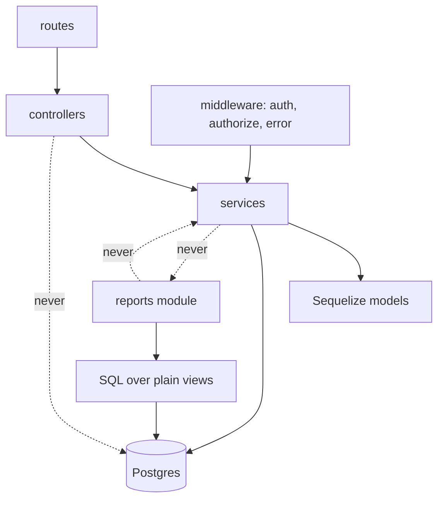
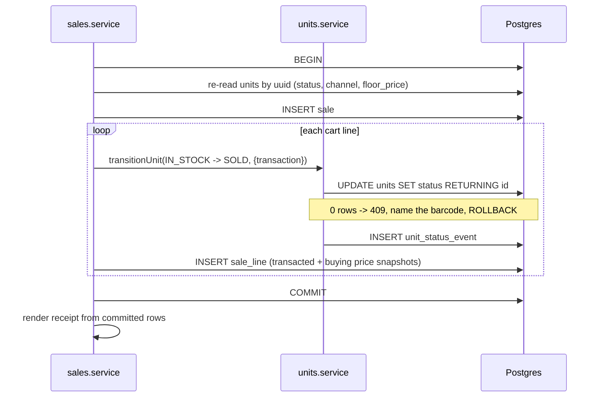
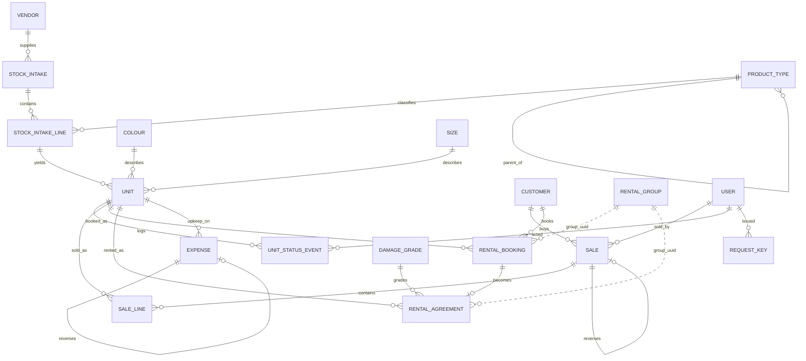
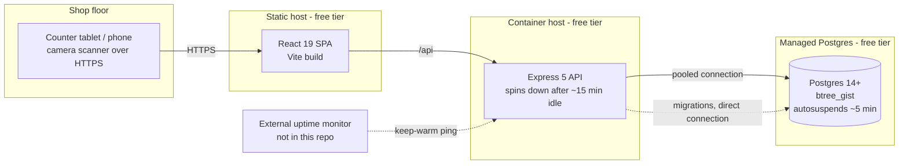

# Architecture Spine — IMPOC Core

## Design Paradigm

**Layered modular monolith with a ledger-style write side and a CQRS-lite read side.**

Three ideas, each carrying a whole model:

- **Layered modular monolith** — the shape already in the repo. One Express process, one Postgres. Every feature is a directory under `backend/src/modules/<name>/` running `routes → controller → service → Sequelize model`, with `<name>.validation.js` holding the Zod schema. No new process, no queue, no service boundary.
- **Ledger-style write side** — transaction rows are accounting entries, not mutable records. Once a row reaches a terminal state it is frozen; corrections are additive reversing rows. This is what makes "never UPDATE a completed transaction" a structural property rather than a discipline.
- **CQRS-lite read side** — the dashboard does not read through the write model. A single `reports` module issues hand-written parameterised SQL against plain (never materialized) views. Same database, same transaction-free read path, opposite modelling pressure.

The three map onto directories:

| Layer | Lives in |
| --- | --- |
| Write side (command) | `backend/src/modules/{barcode,picklists,vendors,intake,units,customers,sales,rentals,expenses}/` |
| Read side (query) | `backend/src/modules/reports/` — one file per dashboard question, plus `reports.sql.js` |
| Ledger schema + views | `backend/database/migrations/`, `backend/database/models/` |
| Cross-cutting | `backend/src/middleware/`, `backend/src/constants/` |

## Invariants & Rules

### Dependency direction



A service may call another module's service. A service may **not** call another module's controller, and the `reports` module may **not** call a write-side service or a Sequelize model — it owns SQL and nothing else. Nothing but a service opens a transaction.

**One sanctioned exception:** `units.service` reads `rental_bookings` directly for AD-8's booked-unit guard, never through `rentals.service`. `rentals.service` already calls `units.service.transitionUnit()`, so routing the guard's predicate back through `rentals.service` would be a circular import that fails at ESM module load, not merely a style violation — the direct table read is the one write-side cross-module read this spine permits, and it exists nowhere else.

---

### AD-1 — The API speaks `uuid`; the integer `id` never leaves the process `[ADOPTED]`

- **Binds:** all new tables, all routes, all response payloads
- **Prevents:** half the modules exposing `id` and half exposing `uuid`, making every client-side reference ambiguous and leaking row counts.
- **Rule:** Every new table carries an integer primary key declared exactly as the repo already declares it — Sequelize `{ type: Sequelize.INTEGER, autoIncrement: true, primaryKey: true }`, which emits `SERIAL` — **and** `uuid UUID NOT NULL UNIQUE DEFAULT gen_random_uuid()` via `Sequelize.literal('gen_random_uuid()')`, matching `database/migrations/20260807174936-create-users.js` line for line. Do not switch new tables to `GENERATED … AS IDENTITY`; a split between `SERIAL` and identity columns across the schema is exactly the drift this AD exists to prevent. Foreign keys reference `id`. Route params, request bodies, and response bodies use `uuid` only. The one exception is `unit.barcode`, which is the scan-time lookup key.

### AD-2 — All money is `BIGINT` paise `[ADOPTED]`

- **Binds:** every `*_paise` column, every computed figure
- **Prevents:** one builder choosing `INTEGER` and another `BIGINT`, and any reintroduction of a float or `NUMERIC` in a report query.
- **Rule:** Every money column is `BIGINT NOT NULL` (or nullable where the domain allows) and named with a `_paise` suffix. No `FLOAT`, `REAL`, `NUMERIC`, or `DECIMAL` column exists anywhere in the schema. Every money column additionally carries a named `CHECK (<col> >= 0)`. The only columns exempt are the ones that must go negative by design, and they are enumerated rather than assumed — this is a **closed set of two**: `sale_lines.*_paise` on a reversing line, and `sales.exchange_difference_paise`. AD-31's amendment adds no third, because AD-33 leaves it nothing to sign. Separately, a **view** column carries no `CHECK` at all and so is outside this list by construction: `v_net_sale_lines`'s netted columns, `v_rental_income.amount_paise` and AD-35's `v_unit_status_events.shrinkage_paise` are all signed by design and constrained by nothing. That is stated because the paragraph above otherwise reads as though it covers every money figure in the system, and a signed view column is a deliberate design choice a builder must not "correct". **The list is closed but not frozen: any future column that must go negative is added here explicitly before it ships — silence is not an exemption — and the only column that never needs adding is a view column, which carries no `CHECK` at all by construction.** Separately, `overdue_per_day_paise` carries `CHECK (overdue_per_day_paise > 0)` on both `stock_intake_lines` and `units` — AD-16 divides by it to cap the rental period, and "greater than `rent_per_day`" does not keep it above zero when `rent_per_day` is itself unbounded below.

  Ratios that the dashboard needs — margin %, sell-through, utilisation, payback, ROI — are computed in the read layer as a numerator/denominator pair returned to the client, never stored and never rounded in SQL.

  **Rounding and money formatting are bound here, not left to "display".** One formatter module renders every money figure as `paise / 100` with exactly two decimal places, half-up rounding, and Indian digit grouping; a ratio is rounded once at that final step and never at an intermediate one. This is a client obligation in the same class as AD-19.1, AD-22, AD-25 and AD-26 — the *Deferred* frontend entry does not cover it. Without it the dashboard epic and the receipt epic each pick a format, and CAP-22's "numbers reconcile" is judged by a human reading two screens.

  **On the read side, every BIGINT column arrives as a JavaScript number, not a string.** AD-43 configures the pg driver pool at startup to parse all int8 values as numbers, so this AD's formatter receives a number and never needs to handle the string variant. The parsing point is a pool-level configuration, not per-query or per-model work, and it affects all BIGINT columns uniformly.

### AD-3 — Constrained string columns, never a Postgres `ENUM` `[ADOPTED]`

- **Binds:** `unit.status`, `unit.channel`, `rental_booking.state`, `rental_booking.payment_method`, `rental_agreement.settlement_method`, `sale.payment_method`, `expense.category`, `damage_grade.outcome`, `request_key.gesture_type`, `request_key.result_kind`
- **Prevents:** an `ALTER TYPE` migration every time a value is added, and two builders disagreeing on whether the allowed set lives in the DB or in JS.
- **Rule:** Each is `VARCHAR(n) NOT NULL` plus a named `CHECK` constraint added via `queryInterface.addConstraint({ type: 'check' })`, following the `users_status_check` idiom already in the repo. The same allowed set is mirrored as a frozen object in `backend/src/constants/`, one file per set, and the service layer validates against the constant. The CHECK is the backstop; the constant is what code reads.

  **Every constrained value is `UPPERCASE_SNAKE`** — `IN_STOCK`, `HANDED_OVER`, `UPI`, `RENTAL_UPKEEP` — matching the `users_status_check` values the repo already carries and the spec's own wording. Case is fixed here because nothing else fixes it: a `'UPI'` in one epic and a `'upi'` in another surfaces only as a runtime `23514`, which AD-11 routes to a generic check-constraint message that names nothing useful. One shared `payment-method.js` constant serves all three money-movement columns rather than three near-identical sets.

### AD-4 — Every new table has `deleted_at`, and every partial index predicate must exclude it

- **Binds:** all new tables, every partial unique index, the rental exclusion constraint
- **Prevents:** the classic bug where a soft-deleted row keeps holding a unique slot — a cancelled-and-deleted booking permanently blocking its dates, or a deleted customer's WhatsApp number never becoming reusable.
- **Rule:** Every new table carries `deleted_at TIMESTAMPTZ NULL`; models set `paranoid: true` with `deletedAt: 'deleted_at'`. **Every partial unique index and the exclusion constraint must include `deleted_at IS NULL` in its predicate.** Existing tables (`users`, `roles`, `permissions`, `auth_sessions`) are out of scope and are not retrofitted. On **both** append-only and terminal-freeze tables (AD-5 tiers 1 and 2) the column exists for uniformity and predicate symmetry only and is **never written** — a correction on tier 1 is a reversing row, and tier 2 permits no delete at all. Only mutable master data is ever soft-deleted. The predicates keep their `deleted_at IS NULL` clause regardless: a predicate that is always true costs nothing, and dropping it on some tables and not others is the asymmetry that invites a mistake.

### AD-5 — Row mutability tiers

- **Binds:** every table; directly resolves the tension between CAP-24 erasure and the never-UPDATE constraint
- **Prevents:** two builders drawing the never-UPDATE line in different places — one freezing a booking the moment it is created (so it can never be handed over), another freely updating a settled agreement.
- **Rule:** Three tiers, and the tier decides what may be written:

The table is **exhaustive over every table in migrations 03–20 and 23**. A tier is never inferred.

  | Tier | Tables | Write rule |
  | --- | --- | --- |
  | **Append-only ledger** | `sales`, `sale_lines`, `expenses`, `unit_status_events`, `customer_erasure_audit`, `request_keys` | INSERT only. Never UPDATE, never soft-delete. Corrections are reversing rows. `request_keys` (AD-22) has no correction at all: a row records that a gesture happened and what it produced, and rewriting one would make a replay return the wrong result. |
  | **Ledger with a terminal freeze** | `rental_bookings`, `rental_agreements` | UPDATE permitted **only** to advance the row toward its terminal state (`OPEN → HANDED_OVER → SETTLED\|CANCELLED\|WRITTEN_OFF`; `returned_at`, `written_off_at` and the settlement columns written exactly once). Once terminal, frozen forever. **One exception, AD-31:** `start_date` and `end_date` may be **widened** while the row is still `OPEN` — never narrowed, so rent only ever goes up. |
  | **Mutable master data** | `customers`, `vendors`, `units`, `stock_intakes`, `stock_intake_lines`, `product_types`, `colours`, `sizes`, `damage_grades`, `app_settings`, `user_preferences` | Ordinary UPDATE and soft delete — **except** the carve-outs below. |

  Two carve-outs on `units`, because this table is the one a builder consults to answer "may I update this row?" and an unqualified yes here contradicts AD-8 one AD later:

  - `status`, `channel` and the three rental snapshots (`rent_per_day_paise`, `deposit_paise`, `overdue_per_day_paise`) are **AD-8's alone**. No other module writes them.
  - `buying_price_paise`, `selling_price_paise`, `floor_price_paise` and those same three rental snapshots are **frozen once the unit first leaves `IN_STOCK`**, enforced in `units.service`. "First" is literal and AD-35 is why it is worth saying: a recovered unit coming back to `IN_STOCK` from `LOST` does **not** thaw them, or the piece that was written off at one buying price could be re-valued at another and Q10's shrinkage would no longer net to zero across the loss and the recovery. Otherwise a typo correction a month after the unit sold leaves Q1's margin (from the sale-line snapshot) permanently disagreeing with Q13's per-unit ledger and Q16/Q23 (which read `units.*`), with both obeying every AD.

  `damage_grades` is master data and is named here rather than left inside "all picklists", because `default_charge_paise` is a money column on a soft-deletable row that settled agreements snapshot from. **A settled agreement's `damage_grade_id` is never resolved for its current `default_charge_paise`** — `damage_charged_paise` on the agreement is the snapshot and the only figure ever read.

  **A walk-in INSERTs at `OPEN`** and advances to `HANDED_OVER` by the same compare-and-swap as the booked path, inside the one transaction (AD-10). It never inserts straight at `HANDED_OVER`: that would give the busiest path a row shape no `WHERE state = 'OPEN'` guard can ever reach, so whatever that guard carried is skipped exactly where it matters most.

  A row is "completed" — and so covered by the spec's never-UPDATE constraint — from the moment it reaches its terminal state, not from the moment it is inserted. `customers` is master data, which is precisely why CAP-24 erasure does not breach the constraint.

### AD-6 — Shop time is `Asia/Kolkata`, and no day boundary comes from the server clock

- **Binds:** CAP-20 (overdue), CAP-23 (exchange window), CAP-22 (every date range), Q2 till reconciliation
- **Prevents:** an overdue unit appearing 5½ hours early or late, an exchange refused on day 7, and the till not reconciling at close — all of which happen silently once the app is hosted on a UTC server (which the chosen free hosting will be).
- **Rule:** All timestamps are `TIMESTAMPTZ` (Sequelize `DataTypes.DATE` on Postgres). All calendar dates — `start_date`, `due_date`, `purchased_on`, `incurred_on` — are `DATE` (`DataTypes.DATEONLY`) and are shop-local by definition, never converted. Wherever a timestamp must be reduced to a shop day, it is done in SQL as `(<col> AT TIME ZONE 'Asia/Kolkata')::date`, never in JavaScript and never from `new Date()`. "Today" for overdue is `(now() AT TIME ZONE 'Asia/Kolkata')::date`. The timezone is a single constant, not repeated as a literal.

  Two boundaries this AD claims to settle, settled explicitly rather than left to a reader:

  - **Overdue** is strict on the shop day: `status = 'RENTED' AND today > due_date`. Due on the 17th is not overdue on the 17th.
  - **The exchange window** is counted in shop days, inclusive of the last: an exchange is accepted while `today <= (sold_at AT TIME ZONE 'Asia/Kolkata')::date + :windowDays`. With the default 7, a sale at 21:00 on the 1st is exchangeable all through the 8th and refused on the 9th. It is *not* an instant-plus-168-hours comparison, which would make the same sale's fate depend on the hour it happened to be rung up.

### AD-7 — Rental availability is a generated `daterange` guarded by a partial `EXCLUDE` constraint

- **Binds:** CAP-17, CAP-18, `rental_bookings`; answers the spec's `reserved`-is-not-a-status constraint
- **Prevents:** two clerks booking overlapping windows on the same saree in the same second — which no application-level overlap check can stop — and prevents a second builder inventing a `reserved` status or a lock table to close that hole.
- **Rule:** `rental_bookings` stores `start_date DATE` and `end_date DATE` as the canonical, domain-facing columns. Alongside them sits a generated column that exists only as a constraint and index surface:

  ```sql
  period daterange GENERATED ALWAYS AS (daterange(start_date, end_date, '[]')) STORED
  ```

  Guarded by:

  ```sql
  CREATE EXTENSION IF NOT EXISTS btree_gist;

  ALTER TABLE rental_bookings
    ADD CONSTRAINT rental_bookings_no_overlap
    EXCLUDE USING gist (unit_id WITH =, period WITH &&)
    WHERE (state IN ('OPEN', 'HANDED_OVER') AND deleted_at IS NULL);
  ```

  Bounds are `'[]'` — inclusive both ends, because a piece due back on the 17th is out on the 17th. `period` is **not** declared on the Sequelize model; it is generated, and any attempt to INSERT it errors. Sequelize 6 `addConstraint` has no exclusion type, so this is raw `queryInterface.sequelize.query()` DDL in the migration, with a matching raw `DROP CONSTRAINT` in `down()`.

  The availability *query* the UI calls is advisory only and uses the same GiST index:

  ```sql
  SELECT 1 FROM rental_bookings
   WHERE unit_id = :unitId
     AND period && daterange(:start, :end, '[]')
     AND state IN ('OPEN','HANDED_OVER')
     AND deleted_at IS NULL;
  ```

  The constraint, not that query, is the authority. A `23P01` exclusion violation is translated (AD-11) to a 409 naming the unit and the conflicting window.

### AD-8 — A unit's status transition is a compare-and-swap, and that is the universal unit race guard

- **Binds:** CAP-12, CAP-14, CAP-18, CAP-19, CAP-23 — every path that moves a unit
- **Prevents:** two carts both selling one unit; a returned unit being settled twice; an exchange and a sale racing on the same piece. Also prevents a builder reaching for `SELECT … FOR UPDATE` or an advisory lock on the hot path.
- **Rule:** `units.service.js` is the **sole writer of `units.status`, `units.channel`, the three rental snapshot columns, and `unit_status_events`**, and it writes them together in one exported function, `transitionUnit({ unitId, to, reason, actorUserId, cause }, { transaction })`. Callers pass their own transaction; no other module UPDATEs `units.status` and **no other module INSERTs into `unit_status_events`**. Splitting the two — one epic writing the status, another writing the event — would produce duplicate audit rows and double every `occurred_at`-anchored figure (Q10, shrinkage), or none at all on a path that forgot.

  The status change inside that function is a single conditional UPDATE whose `WHERE` names the expected current status:

  ```sql
  UPDATE units SET status = :to
   WHERE id = :id AND status = :expectedFrom AND deleted_at IS NULL
  RETURNING id;
  ```

  Zero rows returned means another transaction won the race, or the transition is illegal from the unit's actual status — the service re-reads the unit and throws a 409 naming the barcode and the real status, satisfying CAP-10's "current status named in the error". This is one atomic DML statement, not application-level locking. The legal `(channel, from, to)` set from `unit-state-machine.md` lives in one table-driven guard in `units.service.js`. Two rules that guard carries, which would otherwise be guessed:

  - **A unit with a live booking cannot leave the floor except by hand-over.** Any transition out of `IN_STOCK` other than the hand-over path is refused with a 409 whenever an open booking on that unit covers today or later, and the error **names the blocking booking, its window, and the customer's snapshotted name**. The predicate is evaluated by `units.service` reading `rental_bookings` directly — the one sanctioned cross-module table read named in the *Dependency direction* rule above, carved out here rather than left to be discovered as an ESM load failure the first time someone routes it through `rentals.service` instead. Staff cancel the booking first — which refunds the deposit through AD-27 and prompts the call — and only then mark the unit damaged, lost or retired. The damage transition deliberately does **not** auto-cancel the booking: one gesture must never silently move a third party's money. **`RENTALS.CANCEL` is `MANAGER` and above (AD-29), so a `CASHIER` who meets this guard cannot clear it alone and must get a manager.** Rejected, on Raviraj's decision: extending `RENTALS.CANCEL` to `CASHIER` so they could self-serve — cancelling sends the customer's deposit back, and someone should phone her about her order before that happens. A cashier fetching a manager *is* that phone call, not friction to design away, and the 409's named booking and customer are what the manager acts on.
  - **A booking's state advances by the same compare-and-swap shape**, and this is stated because the spine previously specified CAS only for `units.status` and `rental_agreements.returned_at`, leaving the booking's own lifecycle to be written as a bare UPDATE by whoever got there first:

    ```sql
    UPDATE rental_bookings SET state = :to
     WHERE id = :id AND state = :expectedFrom AND deleted_at IS NULL
    RETURNING id;
    ```

    Zero rows means another transaction won, or the transition is illegal from the row's actual state. This is the guard a walk-in would silently skip if it were inserted straight at `HANDED_OVER` (AD-5).
  - **`LOST` is not terminal, and the one arc out of it is AD-35's recovery.** The table-driven guard carries `LOST → IN_STOCK`, `LOST → IN_MAINTENANCE` and `LOST → RETIRED` for **both** channels, reachable only through the recovery gesture and never as an ordinary transition — `transitionUnit` is called with `cause: 'RECOVERY'`, and the guard refuses those three `(from, to)` pairs under any other cause. `reason` is mandatory on a recovery and is not defaulted, so the audit row carries why the piece came back. Everything else about `LOST` is unchanged: it is still the only status a person may assign to a piece that is gone (AD-34), and the recovery does not touch a single money row (AD-35).
  - **Channel conversion is explicit in both directions.** A `RETAIL → RENTAL` conversion requires all three rental prices as explicit inputs, because there is no lot to inherit them from. A `RENTAL → RETAIL` conversion NULLs all three and is refused unless the unit is `IN_STOCK` with no open booking. Since the guard keys *on* channel, a channel written outside it can put a unit into a state the guard considers illegal.

  `domain-model.md`'s SaleLine section now agrees with this AD: the checkout race guard is "at most one **standing** sale line per unit", not a unique constraint on `unit_id`, so a resale after exchange is not blocked. The compare-and-swap above is that guard's literal implementation. A partial unique index on `sale_lines(unit_id) WHERE deleted_at IS NULL` is **not** added; the index that is added is AD-9's.

### AD-9 — At most one reversal per row, and at most one open agreement per unit, are database facts

- **Binds:** CAP-19, CAP-21, CAP-23
- **Prevents:** one sale line reversed twice, one agreement settled twice, one expense reversed twice — producing a takings figure that silently double-subtracts.
- **Rule:** Every reversal pointer carries a partial unique index, so the ledger's "at most one reversal per row" is a database fact:

  ```sql
  CREATE UNIQUE INDEX sales_one_reversal        ON sales(reverses_sale_id)                WHERE reverses_sale_id      IS NOT NULL AND deleted_at IS NULL;
  CREATE UNIQUE INDEX sale_lines_one_reversal   ON sale_lines(reverses_sale_line_id)      WHERE reverses_sale_line_id IS NOT NULL AND deleted_at IS NULL;
  CREATE UNIQUE INDEX expenses_one_reversal     ON expenses(reverses_expense_id)          WHERE reverses_expense_id   IS NOT NULL AND deleted_at IS NULL;
  CREATE UNIQUE INDEX agreements_one_open_unit  ON rental_agreements(unit_id)             WHERE returned_at IS NULL AND written_off_at IS NULL AND deleted_at IS NULL;
  ```

  The header-level index matters because the exchange path writes both a header and lines: without it a double reversal with zero or disjoint lines slips past the line-level guard. The last is the spec's "`unitId` unique among open agreements", and its predicate carries `written_off_at IS NULL` so AD-32's write-off releases the unit's slot. Settlement's own guard is the same compare-and-swap shape as AD-8: `UPDATE rental_agreements SET returned_at = … WHERE id = :id AND returned_at IS NULL RETURNING *` — zero rows means already settled. **The same transaction also advances the booking `HANDED_OVER → SETTLED`** by AD-8's booking CAS; settlement is not complete until both rows are terminal. Stated because it is the load-bearing half a builder would skip, having already written `returned_at` and considered the job done: a booking left at `HANDED_OVER` keeps its deposit in `v_deposits_held` **and its rent in `v_rent_held`** forever (AD-13), keeps AD-7's `EXCLUDE` holding dates the shop has back on the floor, and never reaches the tier-2 freeze, so the row stays editable for good — the same failures AD-32 exists to prevent for the piece that never returns. Under AD-33 there is now a fourth: the booking never reaches a close event, so **its income is never recognised at all** and the shop's takings are quietly short by a whole hire. Sequelize 6 `addIndex` supports `unique: true` with a `where` predicate, so these go through `queryInterface`, not raw SQL.

### AD-10 — One transaction per counter gesture, opened by the service, with nothing slow inside it

- **Binds:** CAP-7, CAP-14, CAP-18, CAP-19, CAP-23
- **Prevents:** a controller or model hook opening a transaction; a checkout split across two transactions leaving a unit `SOLD` with no sale line; and a pdfkit render holding a pooled Postgres connection open for seconds.
- **Rule:** Transactions are **unmanaged**, as in `user.service.js` and `auth-session.service.js`: `const t = await sequelize.transaction()`, work inside `try`, `await t.commit()`, and a rollback in `catch`. Use the **guarded** form `if (!t.finished) await t.rollback()` from `auth-session.service.js:151`, not the bare `await transaction.rollback()` at `user.service.js:117` — the bare form throws a second, masking error whenever the failure happened after the commit. `t.finished` is an **undocumented Sequelize 6 internal** with no contract, and the spine relies on it deliberately and with its eyes open; the supported equivalent is to catch the rollback's own error. The two existing services are **not** retrofitted, consistent with AD-4's non-retrofit stance — the rule binds new work. Exactly one transaction is opened per counter gesture, in the service, and every write in that gesture passes `{ transaction: t }`. Controllers and middleware never open one.

  **Nothing inside a transaction may do I/O that is not Postgres** — no PDF render, no barcode encode, no HTTP call, no file write. The receipt (CAP-15, CAP-18) is generated *after* commit, from committed rows, addressed by the sale or group reference. Isolation is Postgres's default **READ COMMITTED** everywhere; `SERIALIZABLE` is not used and no retry loop exists, because every race in this system is closed by AD-7, AD-8, or AD-9.

  The gestures and their contents:



  An **exchange** is one transaction containing both halves: reverse the incoming line (INSERT reversing sale + negated line, guarded by AD-9), CAS the incoming unit `SOLD → IN_STOCK`, then run the outgoing unit through the checkout path above, and record the signed `exchange_difference_paise`. A **settlement** is one transaction scoped to one unit's agreement, leaving its group siblings untouched.

### AD-11 — Postgres constraint violations are translated centrally, never per-service

- **Binds:** all write paths
- **Prevents:** five modules each inventing their own message and status code for the same `23505`, and raw Postgres error text reaching the client.
- **Rule:** One translator module maps `SequelizeUniqueConstraintError` / `SequelizeExclusionConstraintError` and the raw SQLSTATEs `23505` (unique), `23P01` (exclusion), `23503` (FK), and `23514` (check) to a domain error carrying `statusCode` and a message, keyed on the **constraint name**. Constraint names are therefore part of the contract and must be given explicitly in every migration, never left to Sequelize's default. **The call site is mandated, because centralising the table without centralising the call is the same per-service repetition this AD claims to prevent.** One exported wrapper, `withDbErrors(fn)` in `src/lib/db-errors.js`, is where every service write path runs; a write issued outside it is a reviewable violation. It throws the translated error and `error.middleware.js` shapes it, unchanged — verified against the real middleware, which handles only `ZodError` and `error.statusCode`, so an untranslated `SequelizeUniqueConstraintError` carries no `statusCode` and falls through to a generic 500.

  A constraint name **absent from the registry is a 500, logged with the constraint name** — never guessed into a 409. An unrecognised violation is a defect in this spine to be fixed, not a client error to be reported.

### AD-12 — The read side is parameterised SQL over plain views, and a materialized view is forbidden

- **Binds:** CAP-22, all 27 dashboard questions
- **Prevents:** the dashboard being built half in ORM eager-loads and half in SQL; and prevents a materialized view being introduced, which would require a refresh — the cron the spec bans.
- **Rule:** `backend/src/modules/reports/` owns every dashboard query as hand-written parameterised SQL executed with `sequelize.query(sql, { type: QueryTypes.SELECT, replacements })`. The reports module imports no Sequelize model and calls no write-side service. **`CREATE MATERIALIZED VIEW` may not appear in any migration**; every view is a plain view, evaluated at read time.

### AD-13 — Netting lives in the views, not in the questions

- **Binds:** Q1–Q6, Q10, Q13, Q16, Q19, Q22, Q23, Q24; AD-33's three buckets
- **Prevents:** the single highest-value divergence in this system — 27 questions each independently remembering to exclude reversing rows. One that forgets shows reversed sales as revenue, and the spec's reconciliation criterion silently fails.
- **Rule:** Six plain views are the **only** surface a *money or event* question reads — income, liability and unit history alike. No takings, margin, expense, deposit, rent-held or event query may select from `sale_lines`, `expenses`, `rental_bookings`, `rental_agreements` or `unit_status_events` directly. The live-state point-in-time questions (Q7, Q11, Q12, Q15, Q22) net nothing and do read the live tables — but the moment such a question shows a **money** figure, that figure comes from a view.

  | View | Contract |
  | --- | --- |
  | `v_net_sale_lines` | One row per sale line with `net_price_paise` and `net_buying_paise` already signed, reversing lines carried as negatives, reversed originals still present so they cancel. Carries `shop_day DATE`, `sold_by_user_id`, `unit_id`, `customer_id`. |
  | `v_net_expenses` | Expenses with reversals netted, one row per live expense, carrying `unit_id` and `shop_day DATE`. |
  | `v_rental_income` | The **EARNED** bucket: one signed income stream with a `kind` discriminator over **four** kinds, and **every one of them is anchored to a close event, never to the booking's creation** (AD-33). `rent` — anchored to `returned_at`, `cancelled_at` or `written_off_at`, whichever close the booking reached. `overdue` — anchored to `returned_at`. `damage` — anchored to `returned_at`. `forfeited_deposit` — anchored to `written_off_at` **and to nothing else** (AD-34); a `LOST` unit transition on its own never emits a row here. Carries `shop_day DATE`, `unit_id` and the close-event kind. A booking still `OPEN` or `HANDED_OVER` contributes **nothing** to this view — its rent is in `v_rent_held` and its deposit in `v_deposits_held`. Neither deposits held nor rent held ever appear here. |
  | `v_rent_held` | The **RENT HELD** bucket, and AD-33's third surface: one row per **booking** whose rent the shop has collected but not yet earned — sourced from `rental_bookings` **alone**, `WHERE state IN ('OPEN','HANDED_OVER') AND deleted_at IS NULL` — carrying `unit_id`, `customer_id`, `rent_charged_paise` and the booking reference. Exactly `v_deposits_held`'s shape and predicate over the other money column, deliberately, so the two move together and a builder cannot get one right and the other wrong. Nothing is ever subtracted from it; rent leaves by the booking's state leaving the predicate, at which instant the same figure appears in `v_rental_income` as `rent` on the close event's shop day. |
  | `v_deposits_held` | One row per **booking** whose deposit the shop still holds — sourced from `rental_bookings` **alone**, `WHERE state IN ('OPEN','HANDED_OVER') AND deleted_at IS NULL` — carrying `unit_id`, `customer_id`, `deposit_paise` and the booking reference. The **DEPOSITS HELD** bucket of AD-33. `rental_agreements` is **never** a second row source: every `HANDED_OVER` booking already has an open agreement, so a union of the two double-counts the entire rented floor. The single surface for Q6 and for the deposit figure Q22 displays, and the figure settlement reads back. |
  | `v_unit_status_events` | One row per status event carrying `unit_id`, `from_status`, `to_status`, `reason`, `actor_user_id` and `shop_day DATE`. Exists because AD-14 names `unit_status_events.occurred_at` as an anchor while no view exposed it — so every **non-money** event question (Q10 shrinkage) had to reduce the timestamp itself, and the naive `occurred_at >= :from` puts every event between 00:00 and 05:30 IST on the previous shop day. It additionally carries **signed `shrinkage_paise`** and a boolean `is_recovery`: negative the unit's snapshotted `buying_price_paise` on a transition **into** `DAMAGED`, `LOST` or `RETIRED`, positive the same figure on AD-35's recovery **out of** `LOST`, and zero on every other transition. Signed in the view for the same reason reversals are — so Q10 is a plain `SUM(shrinkage_paise)` that cannot forget to net a recovery, and so the recovery is a separable line rather than an invisible one. |

  **One deposit liability source, and one way out of it.** `rental_bookings.deposit_paise` is the **only** column ever summed as a deposit liability, anywhere. Deposits are collected at **booking**, not at hand-over (`domain-model.md`, CAP-22), so a paid booking awaiting collection holds real cash while no agreement row yet exists — and a `HANDED_OVER` booking holds that same cash while an open agreement also exists. Summing both sources counts the whole rented floor twice. `rental_agreements.deposit_paise` is a **settlement-arithmetic snapshot**: it is read one row at a time to cap overdue and damage against the deposit (AD-16, Q12) and is **never summed** — `SUM(` over any `rental_agreements` deposit column is a greppable violation of this AD.

  **Held money leaves by the state change and by nothing else, and both held buckets leave together.** A deposit leaves `v_deposits_held`, and the rent leaves `v_rent_held`, in exactly one way: **the booking's `state` leaves `('OPEN','HANDED_OVER')`.** There are three exits and no others — `SETTLED` at settlement (AD-9, in the same transaction that writes the agreement's `returned_at`), `CANCELLED` at cancellation (AD-27), and `WRITTEN_OFF` when the piece never comes back (AD-32). **No exit subtracts anything from either view.** `deposit_returned_paise` — on `rental_agreements` at settlement, on `rental_bookings` at cancellation — is a *cash-movement* figure, and its only reader is Q2's till reconciliation; subtracting it from the liability drives Q6 negative, because the row it belongs to has already left the predicate.

  The same predicate is what keeps a figure from being counted twice **across** views, and under AD-33 it now does that job for both held buckets at once. **Every paise the shop has taken on a booking sits in exactly one of AD-33's three buckets at any instant, and the booking's state change is the single event that moves it.** Rent is either `v_rent_held` or `rent` income in `v_rental_income` — never both, never neither. A deposit is either `v_deposits_held`, or returned cash that has left every bucket, or `forfeited_deposit` income in `v_rental_income` — never two of those. Because one state change moves both, the close event's transaction must write the state change and the income anchor together or the two buckets disagree for the width of a commit.

  **Q11 and Q12 are live-state questions, not liability questions**, and were wrongly listed against this view. "What is out on rent right now" and "what is overdue" read `rental_agreements` directly — permitted, because neither is a takings, margin, expense, deposit or event query, and neither nets anything. Where such a screen shows a deposit figure it joins `v_deposits_held` on `unit_id` rather than reading a deposit column of its own.

  `overdue_charged_paise` is real money the shop collects and must appear in takings; omitting it from the income stream would leave Q1 permanently unable to reconcile against Q12 and the till.

  **One rent figure is summable, and which bucket it lands in depends on the booking's state.** `rental_bookings.rent_charged_paise` (a total) is the only rent ever aggregated, anywhere — summed through `v_rent_held` while the booking is live and through `v_rental_income` once it has closed, never off the table directly. `rental_agreements.rent_per_day_paise` exists solely as the reference for what *would* have been charged and is never summed — three days at ₹500 discounted to ₹1,200 makes the two disagree by design, and since both are snapshots and neither is derived, no constraint would notice. `rental_bookings` therefore also carries `rent_list_paise` (`rent_per_day × rentalDays`), so a discount is a visible, reportable difference rather than an invisible absence.

  **Realised versus unrealised is a hard split.** Unsold-stock valuation and aging read `units.*`; every realised figure — margin, takings, per-unit ledger — reads `v_net_sale_lines.*`. No single question mixes the two.

### AD-14 — Every question declares a range anchor, and ships as a summary/drill pair

- **Binds:** CAP-22, all 27 questions
- **Prevents:** two questions disagreeing about which timestamp puts a row inside the owner's chosen date range — the reason "takings" and "margin" would fail to reconcile — and prevents totals shipping without the drill-down the spec requires.
- **Rule:** Each question is one file, `reports/questions/q<n>.js`, exporting `summary({ from, to })` **and** `lines({ from, to, ...groupKey })`. Neither is optional; a total the owner cannot open is not an answer.

  **Every anchor in the table below is reached through an AD-13 view that exposes it as a `shop_day DATE` column, with one named exception and no others**, and range filtering is only ever done on that column: `shop_day BETWEEN :from AND :to`. A question may not write `sold_at >= :from` or any variant — which makes a raw-timestamp filter a greppable violation rather than a judgement call. Comparing a `TIMESTAMPTZ` against a date parameter resolves it at the *session* timezone — UTC on the hosted server — which silently reintroduces the exact 5½-hour error AD-6 exists to prevent, and does so for the four timestamp anchors while leaving the two `DATE` anchors correct, so takings and expenses would disagree about where the day ends and Q2's till reconciliation would fail. Each view computes `shop_day` once as `(<anchor> AT TIME ZONE 'Asia/Kolkata')::date`. **The Row source column below names the view every anchor is actually read through, not the table the anchor happens to live on** — an earlier draft of this table named the underlying table for seven of its eight rows while the prose above claimed "no exceptions", which was false as written: `stock_intakes` has no view among AD-13's six, so there was no compliant path to it at all.

  | Row source | Anchor | Because |
  | --- | --- | --- |
  | `v_net_sale_lines` | `sale.sold_at` | The sale happened then. |
  | `v_rental_income` (rent, on a booking that closed by settlement) | `rental_agreements.returned_at` | AD-33: rent is earned at the close event, and this is the close. |
  | `v_rental_income` (rent, on a booking that closed by cancellation) | `rental_bookings.cancelled_at` | AD-33 + AD-27: a cancellation is a close event, and forfeits the rent on its own day. |
  | `v_rental_income` (rent + forfeited deposit, on a booking closed by write-off) | `rental_agreements.written_off_at` | AD-33 + AD-34: the day a person marked the piece lost. **The single anchor for a forfeited deposit** — a `LOST` unit transition is never a second one. |
  | `v_rental_income` (damage, overdue) | `returned_at` | Both charges are assessed at settlement; both are `v_rental_income` kinds, same as rent. |
  | `v_net_expenses` | `incurred_on` | Already a shop-local date, so no `AT TIME ZONE` conversion is needed — but reversals still net through the view, so the read goes through it anyway. |
  | `stock_intakes` — **the one raw-table exception** | `purchased_on` | Already a shop-local date, and AD-13's direct-read ban never named `stock_intakes` in the first place (its list is `sale_lines`, `expenses`, `rental_bookings`, `rental_agreements`, `unit_status_events`) — there is nothing to net and no timezone hazard to close, so no sixth view exists for it. |
  | `v_unit_status_events` | `occurred_at` | Shrinkage and AD-35 recovery are events. Reached through the view, never the table. |

  **`rental_bookings.created_at` is not an anchor and must not be one.** It was, until AD-33; a range filter on it is now a greppable violation in exactly the way a raw-timestamp filter is, and it is named here rather than merely dropped from the table so that a builder who finds it in an older query knows it is stale rather than missing.

  **A reversal anchors to the reversing row's own shop day, never the original's.** A September sale exchanged in October leaves September's takings exactly as they closed and carries the negative in October. The alternative — anchoring the reversal to the original sale's day — retroactively mutates a period the owner has already read and acted on, which is the reporting equivalent of UPDATEing a completed transaction. Both readings were derivable from AD-13's "reversed originals still present so they cancel"; this settles it. Within a single range the two are identical and the spec's netting rule holds unchanged.

  Q6 (deposits held), Q7 (on the floor), Q11/Q12 (out on rent, overdue), Q15 (in the workshop) and Q22 (booked not collected) are **point-in-time, not range** questions: they answer "right now" and ignore `from`/`to`. Each says so in its file header. **AD-33's RENT HELD question and AD-34's deposit-exhaustion review list join that list**, and RENT HELD must, for a reason worth stating: an AD-31 amendment changes `rent_charged_paise` on a live booking, so if RENT HELD were a range figure an extension would retroactively move a number the owner had already read — the very failure AD-33 exists to remove. Held money has no range; it is a balance, and a balance is only ever "now". Both held buckets are read the same way, from the same predicate, and neither takes `from`/`to`.

### AD-15 — The index set is fixed here, and exists for correctness of plan shape, not throughput

- **Binds:** CAP-22
- **Prevents:** indexes accreting per-question, ad hoc, until the same column carries three overlapping ones — and equally prevents over-engineering for a scale this shop will not reach.
- **Rule:** One shop is the design point, permanently — order 10⁴ units and 10⁵ sale lines over five years, no `shop_id` column anywhere, no multi-tenancy. At that volume every question below runs in milliseconds. There is **no cache layer, no read replica, no denormalised total, and no summary table.** The index set is exactly — and "exactly" is kept deliberately, because it is the falsifiable claim that makes a gap findable:

  | Index | Serves |
  | --- | --- |
  | **Expression** index `((<col> AT TIME ZONE 'Asia/Kolkata')::date)` on `sales.sold_at`, `rental_agreements.returned_at`, `rental_agreements.written_off_at`, `rental_bookings.cancelled_at`, `unit_status_events.occurred_at` | every range question. A plain b-tree on the raw column **cannot serve** the only filter AD-14 permits. The set is exactly AD-14's timestamp anchors; `rental_bookings.created_at` **left this list** when AD-33 stopped anchoring rent to it |
  | plain b-tree on `expenses.incurred_on`, `stock_intakes.purchased_on` | the two anchors that are already `DATE` and need no conversion |
  | `units(status) WHERE deleted_at IS NULL`, partial | Q7, Q10, Q11, Q15 |
  | `units(stock_intake_line_id)` | Q8, Q9, Q16 |
  | `sale_lines(unit_id)`, `rental_agreements(unit_id)`, `expenses(unit_id)` | Q13, Q23 — the per-unit ledger |
  | GiST from AD-7's exclusion constraint | availability, Q14, Q22 |
  | `sales(sold_by_user_id)` | Q19, Q20 |
  | `stock_intakes(vendor_id)` | Q16, Q17, Q18 |
  | `sales(customer_id)` | Q21 — AD-18's own correction mandates matching on `sales.customer_id`, and Postgres does not index an FK column automatically |
  | `unit_status_events(unit_id)` | Q13's per-unit ledger, which would otherwise seq-scan the fastest-growing append-only table |
  | `rental_bookings(state)`, `rental_bookings(group_uuid)`, `rental_agreements(group_uuid)` | Q6, Q22, group receipt assembly, and AD-33's `v_rent_held` — which shares `v_deposits_held`'s predicate and therefore its index |
  | `rental_agreements(due_date) WHERE returned_at IS NULL AND written_off_at IS NULL`, partial | Q11, Q12, **and AD-34's deposit-exhaustion review list**. The predicate gained `written_off_at IS NULL` so it matches AD-9's `agreements_one_open_unit` exactly — a written-off agreement is not a live one and must not sit in the overdue list forever |
  | unique `request_keys(gesture_type, request_uuid) WHERE deleted_at IS NULL`, partial | AD-22's replay guard. Not a reporting index — it is the constraint itself, listed here so the "exactly" above stays true |
  | unique `units(barcode)` | every scan; and the sole guard on barcode reuse |

### AD-16 — No scheduler, stated as a checkable prohibition

- **Binds:** CAP-20, CAP-22, and the spec's hardest constraint
- **Prevents:** overdue being "fixed" with a nightly job the first time a query looks awkward.
- **Rule:** **No scheduler, job queue, cron library, or background worker of any kind may enter `backend/package.json`** — `node-cron`, `node-schedule`, `agenda`, `bull`, `bullmq`, `bree` and `cron` are examples, not the definition, so a `croner` or a `toad-scheduler` is equally forbidden. No `setInterval`, no self-rescheduling `setTimeout`, and no second entry point beyond `server.js` may appear in `backend/src/`. Overdue is `status = 'RENTED' AND (now() AT TIME ZONE 'Asia/Kolkata')::date > due_date`, maximum rental period is `floor(deposit_paise / overdue_per_day_paise)`, and **AD-34's deposit-exhaustion date is `due_date + floor(deposit_paise / overdue_per_day_paise)` days** — all three evaluated in the SELECT that renders the page. The third is named here because it is the one most likely to be mistaken for a job: it is a *date the system knows in advance*, and the reflex on seeing one is to schedule something for it. Nothing is scheduled. It is derived on read exactly like overdue, and AD-34 makes it a review list a person acts on. If a query tempts a job, the query is wrong.

  Keep-warm pinging against free-tier idle (AD-19) is an **external** uptime monitor hitting a health endpoint. It is not code in this repo and does not breach this rule.

### AD-17 — A barcode value is a minute stamp plus a within-minute counter, and is numeric-only

- **Binds:** CAP-1, CAP-2, defect D2
- **Prevents:** the `Date.now()` collision in `barcode.service.js`; a prefix letter silently doubling the symbol count so the label no longer scans at 35 mm; and — the reason for the time prefix — a database restore reissuing a number that is already printed on a label sitting on the counter.
- **Rule:** A barcode is **12 digits**, zero-padded, digits only, composed of two fields:

  ```text
  MMMMMMMCCCCC
  └──────┘└───┘
     │       └─ 5 digits: within-minute counter, nextval('barcode_seq') % 100000
     └───────── 7 digits: whole minutes elapsed since 2026-01-01 00:00 Asia/Kolkata
  ```

  **The minute prefix is computed in Postgres, in the same statement as `nextval`** — `SELECT extract(epoch FROM now() AT TIME ZONE 'Asia/Kolkata')::bigint / 60 - :epochMinutes, nextval('barcode_seq') FROM generate_series(1, :n)` or equivalent — never in Node from the container's wall clock. This is stated explicitly because AD-6's ban on `new Date()` is scoped to shop-day reduction, so a builder could correctly read it as not reaching a barcode prefix and compute minutes-since-epoch in JavaScript instead — the least reliable clock in the system, reset on every cold start, and a drifted container clock could reuse a prefix Postgres has already moved past. One clock owns the value end to end; the JS path is never reached, not merely avoided by convention.

  **Uniqueness must not depend on durable state a restore can rewind, and this is what buys that.** The narrower guarantee actually needed — stated as the invariant, not as the probabilistic argument it used to be — is: **the system must never resume issuing labels inside a minute that has already issued one.** A restore normally takes far longer than a minute, which is why the design works at all, but "normally" is not structural on its own, so a cheap belt-and-braces check makes it one: **on boot, the barcode service refuses to issue until the current Postgres minute exceeds `max(left(barcode, 7))` over `units`** — one `SELECT max()`, no new table, no new state. Even a restore that somehow lands inside an already-claimed minute cannot reissue it; the process simply waits. A printed-but-unscanned sheet stays *valid* after a restore instead of having to be discarded, and CAP-2's "the sequence never rewinds after a process restart or a database restore" is met literally rather than approximately.

  `barcode_seq` is a Postgres `SEQUENCE`, never a counter row: a sequence is non-transactional, so a rolled-back sheet burns its numbers and the gaps are harmless because the spec keeps no register of what was printed, whereas a transactional counter row could re-issue numbers already streamed onto a PDF. It is never reset. `SELECT nextval('barcode_seq') FROM generate_series(1, :n)` still allocates a whole sheet run in one round trip; the minute prefix is computed once per request, in that same statement.

  **Sheet generation is a mutating gesture governed by AD-22 like any other** — `gesture_type = 'BARCODE_GENERATE'` — but its `request_keys` row is a marker, not a register: no allocated range is persisted, because that would recreate exactly the `BarcodeBatch`/`BarcodeIssue` table CAP-2 forbids. A replay therefore does not reproduce the sheet; it burns no second block and tells the client the request already ran. See AD-22 for the mechanics.

  | Field | Capacity | Exhausted |
  | --- | --- | --- |
  | 7 minute digits | 10,000,000 minutes | ≈ 19 years, so 2045 |
  | 5 counter digits | 100,000 labels per minute | never, at one shop |

  Two collisions remain conceivable and are named rather than hidden. Issuing **100,000 labels inside one minute** wraps the counter — that is the stated ceiling, not a defect. A **backwards server clock jump** (an NTP correction, a host migration) could repeat a minute; this is far rarer than the restore case it replaces, and `units.barcode`'s unique constraint stops being the primary defence and becomes a genuine last resort, refusing the scan at intake exactly as CAP-7 specifies.

  The encoded value is **digits only** — any configured prefix must itself be numeric or empty — so the encoder stays in Code 128 subset C, which packs two digits per symbol. A letter prefix forces subset B, one symbol per character, and breaks CAP-1's 35 mm.

  **The width is structural, not a free number.** Only two layouts exist: 7+5 = 12 digits (the default) and 7+3 = 10 digits. Both are even, which subset C requires. AD-28 holds the choice between the two, not an arbitrary digit count.

  That constraint is arithmetic, not taste. A Code 128 symbol is 11 modules; start is 11, check is 11, stop is 13, and the quiet zone is 10 modules a side. In subset C an even digit count `d` costs `d/2` data symbols:

  | Digits | Modules incl. quiet zone | X-dimension at 35 mm |
  | --- | --- | --- |
  | 10 | 110 | 0.318 mm |
  | 12 | 121 | 0.289 mm |
  | 14 | 132 | 0.265 mm |

  Below roughly 0.25 mm a laser-printed label stops decoding reliably on a phone camera. The chosen 12 digits sits at 0.289 mm — above that floor, with less headroom than 10 would give, accepted deliberately in exchange for the 100,000-per-minute counter. As CAP-1 insists, the number that settles this is a caliper reading against a physical print, not this table.

### AD-18 — Erasure mutates only `customers`, and no historical read may join to it

- **Binds:** CAP-13, CAP-24, Q21
- **Prevents:** the failure that makes CAP-24 look correct in the schema and wrong on screen — a receipt or a takings figure that joins `sales → customers` for a name, and so changes the day a customer is erased.
- **Rule:** Erasure is a single UPDATE on the `customers` row: `name` and `email` and `date_of_birth` set NULL, `whatsapp_number` set NULL, `erased_at` and `erased_by_user_id` set. The row, its `id`, and its `uuid` survive so every FK stays intact. `consent_given_at` and `consent_purpose` are retained — they hold no personal data and are the proof that consent existed. An audit row records `customer_id`, actor, and timestamp, and **never the erased values**.

  `whatsapp_number` is therefore `VARCHAR NULL` under a partial unique index — `UNIQUE (whatsapp_number) WHERE whatsapp_number IS NOT NULL AND deleted_at IS NULL` — which releases the number for a different person exactly as CAP-24 requires, since Postgres does not collide NULLs.

  **The binding read rule:** no receipt, sale view, agreement view, or dashboard figure may join to `customers` to obtain a name or number. Those come from `customer_name_snapshot` / `customer_whatsapp_snapshot` on the transaction row. `customers` is joinable only for lookup at capture time (CAP-13) and for the customer's own current-details screen.

  `dashboard-questions.md` Q21 agrees with this AD: it matches new-vs-returning customers on `sales.customer_id`, which survives erasure, and states explicitly that it never matches on `whatsappNumber`.

### AD-19 — Free-tier hosting is the deployment target, and its cold start is an accepted, visible cost

- **Binds:** all; the operational envelope
- **Prevents:** a scan silently failing at the counter and being read as a broken scanner; and prevents PDFs being written to a filesystem that does not persist.
- **Rule:** Backend on a free container host, Postgres on a free managed provider, frontend as static build on a CDN host. Three consequences bind the code:

  1. **Cold start.** A free container host spins down after ~15 minutes idle and takes 30–60 s to return; a free serverless Postgres autosuspends after ~5 minutes and resumes in under a few seconds. The spec forbids an offline queue, so the client must treat this as a first-class state: every scan and checkout call retries with backoff and shows an explicit "waking up" state rather than an error. This is the honest cost of free hosting against a shop-floor scanner, not a bug to be fixed in code.
  2. **Ephemeral filesystem.** Barcode PDFs and receipts stream to the HTTP response. Nothing is written to disk, and no generated artefact is ever read back from disk.
  3. **Pooled connections.** The app connects through the provider's transaction-mode pooler; migrations run on the direct (unpooled) connection string. Sequelize's own pool is kept small (`max: 5`) because the pooler, not Sequelize, does the multiplexing. Nothing in the code may depend on session state surviving between statements — no `SET LOCAL` outside a transaction, no session-level advisory locks, no `LISTEN`/`NOTIFY`.
  4. **The health endpoint is the backend's.** AD-16 exempts keep-warm pinging as "an external uptime monitor hitting a health endpoint", and consequence 1 depends on that monitor existing, but nothing owned the endpoint. The backend serves `GET /api/health`, unauthenticated, mounted in `app.js` outside every module, returning 200 with **no database round trip** — a health check that queries Postgres wakes the autosuspended database on every ping and defeats the free tier it exists to work around.

  Three hard requirements bind whichever managed Postgres is eventually chosen: it must permit `CREATE EXTENSION btree_gist` (AD-7), it must ship the **IANA timezone database** or `AT TIME ZONE 'Asia/Kolkata'` errors and every shop-day figure in AD-13/AD-14 breaks, and it must expose **both** a transaction-mode pooler string and a direct one or the migration story above changes.

### AD-20 — Migrations are ordered by dependency, forward-only once hosted

- **Binds:** the whole build sequence
- **Prevents:** a migration failing halfway because `units` does not exist yet; a view built before its tables; and `down()` being run against the hosted database, where a free tier gives no convenient restore.
- **Rule:** The order in *Structural Seed* below is binding. `down()` is written for local development and is never executed against a deployed database; a mistake in production is corrected by a new forward migration. The `btree_gist` migration is **first and alone**, so a host that forbids the extension fails loudly on step one rather than fifteen tables in.

### AD-21 — The rental group is a `group_uuid` column, not a header table

- **Binds:** CAP-17, CAP-18, CAP-19; `rental_bookings`, `rental_agreements`
- **Prevents:** the rentals epic inventing the identifier that AD-10 already refers to as "the group reference". Without this the retail side has a header (`sales`) and children (`sale_lines`) while the rental side has children and nothing above them, and two builders would resolve that differently — one adding per-row totals, one adding a `rental_booking_groups` table — with `v_rental_income` breaking differently under each.
- **Rule:** Both `rental_bookings` and `rental_agreements` carry `group_uuid UUID NOT NULL`, generated once per counter interaction. **There is no header table.** Per `domain-model.md` the money is already per-unit — `rent_charged_paise`, `deposit_paise` and `payment_method` sit on each booking row — so a header would carry nothing but its own id. The one receipt CAP-18 requires is rendered by selecting every row sharing a `group_uuid`; AD-7's exclusion constraint is unaffected, since it is keyed on `unit_id`.

  Scope rules that follow, and that would otherwise be guessed: **cancellation and settlement are per booking row.** Cancelling "the booking" is N row cancellations inside one transaction; settling one saree closes exactly its own agreement and leaves its group siblings open and overdue-eligible, as CAP-19 requires. Indexed `(group_uuid)` on both tables.

  Two generation rules, because both would otherwise be guessed differently:

  - `group_uuid` is generated **in the service** with `crypto.randomUUID()`, once per gesture — never as a column `DEFAULT gen_random_uuid()`, which would have to be overwritten for siblings 2..n.
  - **The agreement's `group_uuid` is generated fresh at each hand-over gesture and is deliberately not copied from the booking**, because a three-unit booking group may legitimately be collected on two different days. A group receipt is therefore addressed by booking `group_uuid` before hand-over and by agreement `group_uuid` after it — which is what makes CAP-18's one-receipt-per-interaction true in both directions rather than only the first.

### AD-22 — Every mutating gesture carries a client-generated idempotency key, and the key lives in one `request_keys` table

- **Binds:** CAP-14, CAP-17, CAP-18, CAP-19, CAP-23; every mutating gesture in the system; directly closes a hole opened by AD-19
- **Prevents:** the failure AD-19's own retry rule creates. The request commits, the response is lost to a cold-start or pooler timeout, the client retries as instructed, and the second attempt either writes a second sale or fails AD-8's compare-and-swap with a 409 naming a unit *the customer's own committed sale* just took — so a successful sale is reported at the counter as a failure and the cashier rings it again. AD-10's "no retry loop exists" is true for two concurrent gestures and false for one gesture replayed.
- **Rule:** The client generates a UUIDv4 per counter gesture — before the first attempt, reused unchanged across every retry of that gesture — and sends it as `requestUuid`. A gesture with no `requestUuid` is rejected at validation.

  **The key lives in its own table, never on the row the gesture writes.** One `request_keys` table serves the whole system:

  ```sql
  CREATE TABLE request_keys (
    id            SERIAL PRIMARY KEY,
    uuid          UUID NOT NULL UNIQUE DEFAULT gen_random_uuid(),
    gesture_type  VARCHAR(40) NOT NULL,   -- AD-3 constrained set, UPPERCASE_SNAKE
    request_uuid  UUID NOT NULL,          -- the client's key for this gesture
    result_kind   VARCHAR(40) NOT NULL,   -- what result_uuid addresses
    result_uuid   UUID NOT NULL,          -- the committed sale, booking, agreement or group —
                                          -- or, for BARCODE_GENERATE, a bare marker addressing nothing
    actor_user_id INTEGER NOT NULL REFERENCES users(id),
    created_at TIMESTAMPTZ NOT NULL, updated_at TIMESTAMPTZ NOT NULL, deleted_at TIMESTAMPTZ NULL
  );

  CREATE UNIQUE INDEX request_keys_gesture_request
    ON request_keys (gesture_type, request_uuid) WHERE deleted_at IS NULL;
  ```

  The row is INSERTed **inside the gesture's own AD-10 transaction, last — after the result exists**, so the key and the work it guards commit or roll back together and `result_uuid` is never a placeholder. Ordering is stated because the alternative is tempting and wrong: claiming the key first and UPDATEing the result in would need an UPDATE on an append-only table, which AD-5 forbids. The cost of insert-last is that two simultaneous replays both do the work and exactly one commits — the loser rolls back everything, including its unit transitions, so no half-state escapes. That is the correct trade: duplicated work under a rare race, never a duplicated sale. A replay collides on that partial unique index; the service catches the collision through AD-11, reads back `result_kind`/`result_uuid`, and **returns the original committed result with 200**, not a 409. Idempotency stays a database fact, like every other guard here.

  **`client_request_uuid` does not exist on any table.** It was a column on `sales` and on the booking gesture's first `rental_bookings` row, and a column per header row cannot carry more than one gesture against that row — which broke three ways at once. Amending a booking (AD-31) had nowhere to put its key while AD-19.1 instructed the client to retry it, so the rent difference could be collected twice. **Cancelling** a booking writes the same row and collides identically. **Settlement** writes `rental_agreements`, which the column shape never covered at all. And a three-saree booking (AD-21) inserts three rows into a `NOT NULL UNIQUE` column with one real key between them, so two rows had to carry fabricated noise. One table keyed on the gesture rather than the row answers all four.

  **Every mutating gesture is covered, and the set is enumerated so a new one cannot quietly opt out:** `SALE_CHECKOUT`, `SALE_EXCHANGE`, `RENTAL_BOOK`, `RENTAL_HANDOVER`, `RENTAL_AMEND`, `RENTAL_CANCEL`, `RENTAL_SETTLE`, `RENTAL_WRITE_OFF`, `UNIT_RECOVER`, `UNIT_TRANSITION`, `EXPENSE_CREATE`, `EXPENSE_REVERSE`, `INTAKE_SCAN`, `BARCODE_GENERATE`. Adding a mutating gesture without adding its `gesture_type` is a reviewable violation.

  **`BARCODE_GENERATE` is covered too, now that the table exists to make it cheap — but deliberately as a marker only, never as a register.** CAP-2 and `domain-model.md` both forbid a table that records which values were printed or which sheets they appeared on ("no `BarcodeBatch` or `BarcodeIssue` table"); persisting the allocated range (`start_seq`, `count`, the minute prefix) so a replay could regenerate the identical PDF would be exactly that table under a different name, so this AD does not add one. Instead `result_kind = 'BARCODE_SHEET'` and `result_uuid = gen_random_uuid()` **address nothing** — the row's only job is to answer "did this request already run," not "what did it produce." On first request: allocate the run from `barcode_seq`, stream the PDF, then `INSERT` the `request_keys` row last as this AD's ordering rule requires. **On replay, the service does not regenerate a sheet at all** — it finds the existing row, calls no `nextval`, burns no second block, and returns a 200 telling the client the sheet was already generated, so the cashier looks for the one they already have instead of comparing two different PDFs. The trade this AD makes everywhere else — insert-last, exactly-once commit — holds here too; what differs is that the "result" this gesture guards is permission to print, not a value to reproduce.

### AD-23 — Rental days are `(end_date - start_date) + 1`, everywhere

- **Binds:** CAP-17, CAP-18, CAP-19, CAP-20, Q14
- **Prevents:** an off-by-one that the spine itself created. AD-7's inclusive `'[]'` bounds hold a unit for **3** days on a 15th–17th booking, while `domain-model.md`'s `endDate - startDate` charges rent and caps the period at **2**. The booking developer and the settlement developer would each be locally correct and disagree about rent, about `floor(deposit / overdue_per_day)`, and about utilisation — in the customer's favour, silently.
- **Rule:** One named formula, `rentalDays(startDate, endDate) = (endDate - startDate) + 1`, used by **every** consumer without exception: rent charged at booking, the maximum-period check, and Q14's days-booked numerator. A booking of the 15th–17th is three days. This matches AD-7's `'[]'` bounds and the physical fact that the piece is out of the shop on all three days. `domain-model.md` now states the same `+ 1` formula verbatim.

### AD-24 — Prices are snapshotted at two tiers, and no read re-derives them

- **Binds:** CAP-6, CAP-7, CAP-14, CAP-19, CAP-23, Q5, Q13, Q16, Q19
- **Prevents:** the intake epic and the sales epic disagreeing about which fields are copied and when — and, worse, a margin query joining back to the lot, so that editing a lot's buying price retroactively rewrites last quarter's profit.
- **Rule:** Tier one, at intake: a `unit` copies `buying_price_paise`, `selling_price_paise`, `floor_price_paise` and — for rental channel — `rent_per_day_paise`, `deposit_paise`, `overdue_per_day_paise` from its `stock_intake_line`. Tier two, at the transaction: a `sale_line` copies `transacted_price_paise` **and** `buying_price_paise` from the unit; a `rental_booking` copies the three rental terms; both copy `customer_name_snapshot` and `customer_whatsapp_snapshot`.

  **No read path may re-derive a snapshotted value by joining to its source.** AD-5 files `units` and `stock_intake_lines` as mutable master data precisely because the snapshots make that safe — a margin figure reads `v_net_sale_lines.net_buying_paise`, never `stock_intake_lines.buying_price_paise`. An exchange returns the unit to stock carrying its original snapshots unchanged (CAP-23). AD-5 additionally **freezes** the tier-one columns once the unit first leaves `IN_STOCK`, so a later correction to a sold unit's price cannot make Q13 and Q1 disagree.

### AD-25 — The cart is client-side, and every cart rule is re-enforced server-side

- **Binds:** CAP-12, CAP-14
- **Prevents:** a decision that was buried in a parenthetical in the capability map deciding itself. A server-side `carts` table is the obvious alternative and brings its own race story; two epics would choose differently. And with the cart client-side, three of CAP-12's four criteria would otherwise land in the frontend — whose architecture is Deferred — leaving them enforced nowhere.
- **Rule:** The cart is client-side state only; **no `carts` table exists**, which is what makes the spec's "`in_cart` is not a status" true structurally. Adding a unit to a cart changes nothing in the database.

  Every cart rule is nonetheless enforced by the server, in two places. At scan time, `GET /api/units/by-barcode/:barcode` returns the unit with its status and channel, and the **service** refuses a unit that is not `IN_STOCK` or whose channel does not match the cart's — naming the actual status, per CAP-12. At commit time, checkout re-verifies every one of them inside the transaction (AD-8), because the scan-time answer is advisory and may be stale. Duplicate-scan collapsing (CAP-12's "one line, not two") is keyed on `unit.uuid` in the client **and** made harmless server-side by AD-8: the second CAS for the same unit in one checkout finds it already `SOLD` and fails the gesture.

### AD-26 — One collection envelope, and every drill-down is paginated

- **Binds:** every list endpoint, all 27 `lines()` functions
- **Prevents:** two epics shipping different list shapes in the same API, and an unbounded drill-down — AD-15 having deliberately removed every escape hatch (no cache, no summary table), a month of sale lines or a unit's lifetime ledger is a real page.
- **Rule:** Inside the existing `{ success, data }` envelope, every collection response is `data: { items: [...], page, pageSize, total }`. Never a bare array. Page size defaults to 50 and is capped at 200 server-side. Every `lines({ from, to, ...groupKey })` accepts and honours `page`/`pageSize`; a `summary()` never paginates, because a total is one row.

### AD-27 — A cancelled booking settles on the booking row

- **Binds:** CAP-17, Q2, Q6
- **Prevents:** the drawer being short with nothing to explain it. `deposit_returned_paise` lives on `rental_agreements`, and a cancelled booking never produced an agreement — so the refund of a deposit on a piece that never left the shop has nowhere to be recorded, and Q2's cash reconciliation loses it.
- **Rule:** `rental_bookings` carries its own `cancelled_at`, `cancelled_by_user_id` and `deposit_returned_paise`, written exactly once when the row moves to `CANCELLED` — the terminal-freeze tier of AD-5, the same shape as settlement on an agreement. No agreement row is invented to carry it.

  **A cancellation is one of AD-33's four close events, and `cancelled_at` is its anchor.** The rent is **not** refunded (CAP-17: a cancellation leaves the rent as charged) and is **recognised as income on the cancellation's own shop day** — it moves out of `v_rent_held` and into `v_rental_income` as `kind = 'rent'` at that instant, having never been income before it. The deposit is returned in full and leaves `v_deposits_held` **by the same state change** — the `CANCELLED` row is outside both views' predicates, so its `deposit_returned_paise` is a Q2 cash figure and is never subtracted from the liability (AD-13). This is the close event where the two buckets part company most visibly: the rent becomes earned and the deposit becomes cash out the door, in one gesture.

### AD-28 — Runtime-tunable values live in `app_settings`; structural ones live in code

- **Binds:** CAP-1, CAP-3, CAP-23; CAP-14, CAP-17, CAP-18, CAP-25 (AD-40's two UPI keys)
- **Prevents:** the barcode epic putting label geometry in a JS constants file — which still fails CAP-1's "tuned against a physical print **without a code change**" — while an admin-settings epic expects it in the database; and prevents two readings of what `app_settings` even is.
- **Rule:** `app_settings` is a **typed key/value table**: `key VARCHAR PRIMARY KEY`, `value_text TEXT`, `value_int BIGINT`, `value_type VARCHAR` with a CHECK, read through one accessor module that returns a parsed value and throws on a missing key. It holds anything an admin retunes without a deploy — the exchange window (default 7), **every label dimension from CAP-1**: barcode width and height, text size, clear space, margins, and the derived grid — and, from AD-40, `upi.payeeVpa` and `upi.payeeName`: a shop's UPI ID and its registered display name can both change (a bank account switch, a rebrand) without a redeploy, the same tunable class as the rest of this table. `barcode.constants.js` keeps only what is structurally fixed: the page size, the two legal barcode layouts of AD-17, and the seeded defaults the table is first populated with. The barcode digit count is **not** a free integer in this table — it selects between AD-17's 12-digit and 10-digit layouts and nothing else.

  Money values in `app_settings` obey AD-2 and use `value_int` as paise. The table is master data (AD-5) and is cached in-process for the request only, never longer — a free-tier instance may be one of several.

### AD-29 — The authorisation matrix is fixed, and it splits on which way money moves

- **Binds:** every new route, `seed-new-permissions`, the frontend's permission-driven navigation
- **Prevents:** the seeder being written twice — once by the rentals epic and once by an admin epic — and, more concretely, a cashier holding the power to give money back on their own authority.
- **Rule:** `RENTALS.*` is **six verbs, one per counter gesture**: `VIEW`, `BOOK`, `HANDOVER`, `EXTEND`, `SETTLE`, `CANCEL`. The granularity is deliberate — `SETTLE` and `CANCEL` move deposit money *out* of the drawer, `BOOK`, `HANDOVER` and `EXTEND` move it *in*, and a coarser `OPERATE` verb would make the split below unexpressible. `RENTALS.SETTLE` also carries AD-32's write-off, which is a settlement that returns nothing. `RENTALS.EXTEND` governs CAP-25/AD-31's amendment (`gesture_type = 'RENTAL_AMEND'`, AD-22) — added here because it is its own counter gesture under this AD's own principle and had no verb until CAP-25 surfaced the gap; it sits with `BOOK`/`HANDOVER` rather than `SETTLE`/`CANCEL` because an extension only ever collects more rent, never returns money.

  **`INVENTORY.RECOVER_LOST` (AD-35) is `MANAGER` and above, and nothing below.** It sits under `INVENTORY.*` rather than `RENTALS.*` because it applies to a retail piece exactly as it does to a rental one, and it is withheld from `INVENTORY_MANAGER` — who otherwise holds the inventory set — because on this matrix's own logic a recovery is a money-moving correction, not a stock chore: it puts written-off value back onto the books.

  | Role | Holds |
  | --- | --- |
  | `ADMIN` | Everything, including `CUSTOMERS.ERASE` and `SETTINGS.MANAGE`, which **no other role holds**. |
  | `MANAGER` | Existing set, plus all six `RENTALS.*`, `INVENTORY.BARCODE_GENERATE`, `INVENTORY.RECOVER_LOST`, and the exchange path that refunds a cash difference. |
  | `INVENTORY_MANAGER` | Existing inventory set, plus `INVENTORY.BARCODE_GENERATE`. **Not** `INVENTORY.RECOVER_LOST`. No counter gestures. |
  | `CASHIER` | Money-in only: `SALES.CREATE`, `RENTALS.VIEW`, `RENTALS.BOOK`, `RENTALS.HANDOVER`, `RENTALS.EXTEND`, `CUSTOMERS.VIEW`/`CREATE`. **Not** `RENTALS.SETTLE`, **not** `RENTALS.CANCEL`, **not** `INVENTORY.RECOVER_LOST`, **not** a refunding exchange — consistent with the existing seeder already withholding `sales.cancel` and `sales.refund`. |
  | `ACCOUNTANT` | Read-only over money: existing `EXPENSES.*`, `REPORTS.VIEW`, `SALES.VIEW`, plus `RENTALS.VIEW`. Never moves a unit or a customer. |

  Every route carries `authorize(PERMISSIONS.X.Y)`; never a role-name test. Navigation renders only what the signed-in user holds, so a withheld gesture is *absent*, not disabled.

### AD-30 — Logs are structured JSON on stdout, carrying a request id

- **Binds:** every module, the error middleware, AD-22's replay path
- **Prevents:** a cold-start retry storm being unreadable. AD-19.1 mandates that the client retries with backoff against a host that takes 30–60 s to wake, so one counter gesture legitimately produces several server-side attempts — and under `console.log` they are indistinguishable from several separate gestures, at exactly the moment someone needs to tell them apart.
- **Rule:** One logger module emits **structured JSON to stdout**. No transport, no external service — the container host captures stdout and that is the whole delivery mechanism. Every line carries a request id, and **the id AD-22's replay path logs is the same one**, so investigating a suspected duplicate sale is one `grep`.

  **An error-tracking vendor is explicitly not adopted, and this AD's original reasoning — "it would be the only outbound dependency in the system" — no longer holds as stated: AD-38 makes WhatsApp the first outbound dependency, so a vendor would be the second, not the only one.** The conclusion is re-derived on a premise that survives AD-38, because the count of outbound calls was never really what the rejection was protecting — their **necessity and containment** was. AD-38's WhatsApp call is necessary (it *is* the receipt-delivery feature, not an add-on to it), triggered by one explicit staff gesture, confined to one route and one module, with a designed fallback for exactly the case where it fails (View, Download PDF, Print). An error-tracking vendor would be a general-purpose, always-on dependency touching every unhandled-exception path in every module — incidental to the business rather than required by it, and pervasive rather than contained. At AD-15's one-shop scale, this system's whole log volume already fits the stdout-plus-request-id design above; a vendor buys nothing that `grep` doesn't already give, at the cost of a second dependency, a bill, and a new failure mode this shop does not need. The conclusion stands unchanged — no error-tracking vendor — now argued on cost/benefit and containment, not on being the sole outbound call.

### AD-31 — A booking may be **extended** while it is still `OPEN`, and never shortened

- **Binds:** CAP-25, `rental_bookings`; the one exception to AD-5's tier-2 rule; gated by `RENTALS.EXTEND` (AD-29)
- **Prevents:** billing a customer twice for one rental. AD-5 tier 2 permits UPDATE only to advance toward a terminal state, so moving a wedding by a week was only expressible as cancel-and-rebook — and since AD-27 leaves a cancelled booking's rent as charged, the customer pays rent twice for one hire. A builder facing that outcome edits the row directly instead, and the tier rule is broken in practice rather than in writing. The containment guard additionally prevents an amendment being used as a back door to a rent refund, which the shop does not do by any route.
- **Rule:** `start_date` and `end_date` may be UPDATEd while `state = 'OPEN'`, and only then. **The amended window must contain the original window.** A booking may be widened at either end; it may never be narrowed at either end, so `rent_charged_paise` only ever goes up and **no rent is ever refunded on an amendment**. Raviraj's call: a customer who has booked a wedding weekend may move it further out, but the shop does not hand rent back because plans shrank. Combined with AD-27 (a cancellation forfeits the rent too), this makes "rent, once collected, is never returned" true without exception.

  The guard rides in the `WHERE` clause of the same compare-and-swap shape AD-8 mandates, so it is one atomic statement and there is no window in which a service could forget it:

  ```sql
  UPDATE rental_bookings
     SET start_date = :newStart, end_date = :newEnd, rent_charged_paise = :newRent
   WHERE id = :id AND state = 'OPEN' AND deleted_at IS NULL
     AND :newStart <= start_date AND :newEnd >= end_date
  RETURNING id;
  ```

  Zero rows means one of three things — the booking is no longer `OPEN`, another transaction won the race, or the amendment tried to shorten it — and the service re-reads the row to tell them apart and name the real reason. `rent_charged_paise` is recomputed by AD-23's `rentalDays` formula over the new window, `rent_list_paise` with it, and the difference is **collected** at the counter within the same gesture. The extension is re-checked against `floor(deposit_paise / overdue_per_day_paise)` exactly as the original booking was (CAP-17), because a longer window against an unchanged deposit is precisely how a booking outruns its own security. This does not breach the ledger paradigm: an `OPEN` booking is not a completed transaction.

  **This AD needs no signed delta row, no new `v_rental_income` kind, and no third entry on AD-2's signed-column list**, and that is a consequence of AD-33 rather than an oversight. An `OPEN` booking's rent was never income — it sits in `v_rent_held` — so recomputing it cannot reach into a period the owner has already read and closed, and there is no closed figure for a delta to correct. The whole amendment is a change to a liability, and the entire amended rent is recognised once, later, on the close event's shop day. Stated explicitly because the amendment-mutates-a-closed-period problem is real under any design that recognises rent at booking, and a builder who has seen that problem will reach for the delta row on reflex.

  One non-obvious property, stated because builders will not assume it: **the generated `period` column recomputes on UPDATE**, so AD-7's `EXCLUDE` re-checks the new window automatically. An extension therefore needs no cancel-then-rebook ordering dance, which under the old reading would have self-collided against the booking's own outstanding range.

### AD-32 — A booking whose unit never comes back terminates as `WRITTEN_OFF`

- **Binds:** CAP-17, CAP-19; `rental_bookings.state`, `rental_agreements`, AD-7's and AD-9's predicates; AD-33's fourth close event
- **Prevents:** a dead unit holding its dates forever. With no arc for "never returned", one developer settles the agreement — writing `returned_at` for a piece that never returned, which is a lie in an audit trail — while another leaves the booking at `HANDED_OVER` in perpetuity, so the `EXCLUDE` holds the window, `agreements_one_open_unit` holds the slot, and the tier-2 freeze never applies so the row stays editable forever. Both readings are defensible and the rows are irreconcilable.
- **Rule:** `rental_bookings.state` carries a fourth terminal value `WRITTEN_OFF`, and `rental_agreements` carries `written_off_at TIMESTAMPTZ`. Both partial predicates honour it: AD-7's `EXCLUDE` stays `WHERE state IN ('OPEN','HANDED_OVER')` so a written-off booking releases its dates, and `agreements_one_open_unit` gains `AND written_off_at IS NULL` so the unit's slot is released.

  **A write-off is AD-33's fourth close event, it recognises `rent` *and* the full deposit, and `written_off_at` is the single anchor for both.** The rent leaves `v_rent_held` and the deposit leaves `v_deposits_held` by the one state change, and both land in `v_rental_income` on `written_off_at`'s shop day — `kind = 'rent'` and `kind = 'forfeited_deposit'`. Nothing is returned to the customer, so `deposit_returned_paise` stays zero and Q2 sees no cash movement at all on this close. `returned_at` is never fabricated, which keeps it meaning exactly one thing: the piece physically came back.

  **One anchor, and the `LOST` transition is not a second one.** A write-off naturally accompanies marking the unit `LOST`, and two developers reading two ADs would otherwise build two legs and count the same deposit twice. `written_off_at` wins because it is the booking's own terminal moment: it does not depend on a unit transition that may not fire, or may fire twice, and under AD-35 the unit may even leave `LOST` again later without any of this money moving. **A `LOST` unit transition alone never emits a `v_rental_income` row**, for a unit with an agreement or without one. The write-off and the unit's move to `LOST` are written in one transaction (AD-34), so the two never disagree about which day it was.

### AD-33 — Rental money is a liability until the rental finishes; income is recognised at the close event

- **Binds:** CAP-17, CAP-18, CAP-19, CAP-22; `v_rental_income`, `v_rent_held`, `v_deposits_held`; AD-13, AD-14, AD-15, AD-27, AD-31, AD-32, AD-34; Q1, Q2, Q4, Q6, Q13, Q23
- **Prevents:** the whole class of failure in which a rental's money is counted on the day the cash arrived rather than the day the shop earned it. Concretely: an `OPEN` booking amended weeks later silently rewriting a month the owner has already read, reconciled and closed — which AD-14 forbids by name — plus a dashboard that shows rent taken on unfinished hires as profit, so the owner reads money the shop may still have to work for, or forfeit, as money already made. It also prevents the reverse mistake once this is built: a builder who finds Q1 and Q2 disagreeing and "fixes" it by moving recognition back to booking.
- **Rule:** **Rent and deposit are both still collected in full at booking** — CAP-17 is unchanged and no customer is asked for money at a different moment. What changes is when that money becomes *income*. **Both are a liability from the instant they are collected until the booking reaches a close event.** Income is recognised at that close event and **anchored to the close event's own shop day, never to the day the booking was created.**

  The shop's rental money therefore sits in **three buckets**, and CAP-22's dashboard must show all three separately and never add them together:

  | Bucket | Surface | What it is |
  | --- | --- | --- |
  | **EARNED** | `v_rental_income` | Real income. **The only one of the three that is income.** Everything Q1 counts as rental takings comes from here and from nowhere else. |
  | **DEPOSITS HELD** | `v_deposits_held` | Customer money that goes back. A liability, and already the shop's practice (Q6). |
  | **RENT HELD** | `v_rent_held` | Rent collected on bookings not yet finished. **New.** A liability today that becomes EARNED at close. |

  RENT HELD gets its own dashboard question in `reports/questions/`, alongside Q6 and built to the same shape — **not** a figure the rentals module computes for a screen of its own. Stated because it was the first genuinely new dashboard surface since the catalogue was written, and a builder with nowhere obvious to put it would grow a second reporting path outside AD-12. `dashboard-questions.md` has since gained it as **Q25**, point-in-time like Q6, with the identical `RentalBooking`-only source and predicate.

  ```mermaid
  graph LR
      COLLECT["Booking made — rent and deposit<br/>both collected in full, cash in the till today"]
      COLLECT --> RH
      COLLECT --> DH
      RH["RENT HELD<br/>v_rent_held — liability"]
      DH["DEPOSITS HELD<br/>v_deposits_held — liability"]
      EARNED["EARNED<br/>v_rental_income — the only income"]
      CASH["Cash back to the customer<br/>Q2 till figure only, never income"]
      RH -->|"any close event"| EARNED
      DH -->|"settle: overdue + damage kept"| EARNED
      DH -->|"write-off: the whole deposit"| EARNED
      DH -->|"settle: the balance"| CASH
      DH -->|"cancel: in full"| CASH
  ```

  **The four close events are exhaustive — a booking terminates in one of these ways and in no other**, and each names the income it recognises and the day it lands on:

  | Close event | Booking reaches | Anchor | Recognised as income on that day |
  | --- | --- | --- | --- |
  | Returned clean | `SETTLED` | `rental_agreements.returned_at` | **rent + any overdue** |
  | Returned damaged and settled | `SETTLED` | `rental_agreements.returned_at` | **rent + any overdue + the damage deducted from the deposit.** The repair the damage charge funds is booked **separately** as a `RENTAL_UPKEEP` expense against the same unit — so both sides show on the unit's ledger and the net effect on profit is honest. The damage charge is income; the repair is a cost; they are two rows, never one netted figure. |
  | Cancelled before hand-over | `CANCELLED` | `rental_bookings.cancelled_at` | **rent, forfeited** (AD-27). The deposit is returned in full and is not income. |
  | Unit marked lost | `WRITTEN_OFF` | `rental_agreements.written_off_at` | **rent + the full deposit** (AD-32, AD-34). Nothing goes back to the customer. |

  **The `rent` kind is a three-legged union, and exactly one leg ever fires per booking.** `rent_charged_paise` lives on `rental_bookings` while two of the three anchors live on `rental_agreements`, so `v_rental_income`'s `rent` stream is `rental_bookings` joined to its agreement, `UNION ALL`-ed over the three terminal states — `SETTLED` anchored to `returned_at`, `CANCELLED` anchored to `cancelled_at` (no agreement exists, so no join), `WRITTEN_OFF` anchored to `written_off_at`. A booking holds exactly one terminal state, so exactly one leg matches and **the rent is recognised once**. Written as three separate views, or as an `OUTER JOIN` with a `COALESCE` over the three timestamps, two builders get two different answers for a booking mid-flight; written as this union they cannot. A booking that is still `OPEN` or `HANDED_OVER` matches no leg at all, which is what keeps it out of income entirely. **A write-off always has an agreement** — a booking that was never handed over is cancelled (AD-27), never written off — so that leg's join is never outer.

  **The deposit's three parts sum to exactly `deposit_paise`, and a write-off recognises it whole.** At settlement the deposit splits three ways and no further: `overdue` income, `damage` income, and the balance returned as cash — capped so the balance never goes below zero (CAP-19), which is the arithmetic that makes DEPOSITS HELD drain to zero rather than negative. At a write-off the **entire** deposit is recognised as `forfeited_deposit` and **no separate `overdue` row is emitted for that booking, ever** — the overdue is what ate the deposit, so counting both would count the same money twice, and it is the most plausible mistake on this path because the overdue figure is sitting right there on the screen the write-off is triggered from.

  **Q1 and Q2 will not match on any given day, and that is correct.** Q1 is income; Q2 is the till. Cash arrives at booking and income is recognised at close, so on a day with three new bookings and no returns the drawer is fuller and the income figure has not moved — and on a day with three returns and no bookings the income figure jumps while the drawer only empties, by the deposit balances handed back. **This is stated as a rule and not left to be discovered, because a builder who meets the mismatch will read it as a defect and repair it by recognising rent at booking again** — which reverts this decision and reopens everything it closes. The two figures reconcile over the life of a booking, never within one day of it. If a reconciliation check is written, it is written against the three buckets plus cash movements, never against Q1 alone.

  `SPEC.md`, `domain-model.md` and `dashboard-questions.md` now state this AD's rule directly — the three-bucket model, income recognised at the close event, and the four exhaustive close events — brought into line by a `bmad-spec` update run against this spine.

  Two consequences that fall out and are worth naming so nobody re-derives them wrongly. First, **an `OPEN` booking contributes nothing to any income figure**, which is why AD-31 can recompute its rent freely without touching a closed period. Second, **`rental_bookings.created_at` is not a reporting anchor** (AD-14) — it records when a hold was placed, and a hold is not a sale.

### AD-34 — A person marks a unit lost; the deposit-exhaustion date is a prompt, never a trigger

- **Binds:** CAP-19, CAP-20, CAP-22; AD-16, AD-32, AD-33; `units.status`, `rental_bookings.state`, `rental_agreements.written_off_at`
- **Prevents:** two opposite failures at once. Automating the write-off — the obvious reading of "the deposit has run out, so the piece is lost" — would need a scheduler, which AD-16 forbids outright, and would declare a customer's saree lost while they are on their way to the shop with it. Leaving the moment entirely to memory is the other failure: with nothing surfacing it, a piece sits `HANDED_OVER` for months, its rent and deposit frozen in AD-33's held buckets, its dates held by AD-7's `EXCLUDE`, and its income never recognised at all. Also prevents the split anchor that let one forfeited deposit be counted twice.
- **Rule:** **Staff mark a unit lost. The system never does, under any condition.** This confirms the spec's existing assumption rather than overturning it, and AD-16's prohibition stands untouched — no cron, no job, no timer, nothing that fires on a date.

  **The app must nevertheless surface the moment, and it does so by deriving it on read.** The day a booking's deposit is fully eaten by overdue charges is known at booking time and needs nothing to have run:

  ```text
  deposit_exhausted_on = due_date + floor(deposit_paise / overdue_per_day_paise) days
  ```

  It is computed in the SELECT that renders the page, in exactly the way overdue is (AD-16), and it drives a **review list of live agreements past that date** — a screen a person opens, reads, and acts on. Both operands are already on the agreement as snapshots (AD-24), so the date never shifts under a later edit. **The date is a prompt for a human, never a trigger.** Nothing in the system may branch on it other than to decide whether a row appears in that list: no status changes, no money moves, no row is written when it passes.

  The list is a `reports/questions/` question, sitting beside Q12 and built like it: paginated per AD-26, reading `rental_agreements` directly as the other live-state questions do (AD-13 permits it — it nets nothing, and the deposit figure it displays is joined from `v_deposits_held`). It is **not** a second reporting path grown inside the rentals module. `dashboard-questions.md` now carries it as **Q26**, point-in-time, with the exhaustion-date derivation and the "prompt, never a trigger" rule stated in both places.

  **Income from the forfeiture is recognised on the day staff actually mark the unit lost — not on the computed date**, however long the gap. A piece whose deposit ran out in April and which staff write off in June recognises rent and the forfeited deposit in **June**. Anything else would anchor income to a date no person ever acted on, and would let a figure appear in a month that had already been read and closed.

  **One anchor for the forfeiture, and it is `written_off_at`.** The human action is one gesture and writes one transaction: the booking advances to `WRITTEN_OFF` (AD-32), the agreement's `written_off_at` is stamped, and the unit transitions to `LOST` through `transitionUnit` (AD-8) — all three, or none. `written_off_at` is the anchor for both the rent and the forfeited deposit; **the `LOST` unit transition is an audit fact and never an income anchor**, so a unit reaching `LOST` — with an agreement or without one — emits no `v_rental_income` row of its own. This is stated in one place deliberately: two anchors for one deposit is how the same money gets counted twice, once by the epic that reads AD-13 and once by the epic that reads AD-32.

  `unit-state-machine.md`'s `rented → lost` row now agrees: rent **and** the whole deposit, anchored to `written_off_at`, with the booking terminating as `WRITTEN_OFF` rather than the agreement simply closing.

  A retail unit, or a rental unit with no live agreement, is marked `LOST` by the same human action through the same guard, with no booking or agreement involved and therefore no income event at all — just the shrinkage that AD-13's signed `shrinkage_paise` records.

### AD-35 — A lost unit can be recovered, and a recovery reverses the stock loss and never the money

- **Binds:** CAP-10, CAP-11, CAP-22; `units.status`, `unit_status_events`, `v_unit_status_events`, AD-8's transition guard, AD-29's matrix; Q7, Q10, Q13, Q23
- **Prevents:** the two ways this gets built wrong. Built as a full reversal, the recovery would unwind AD-33's recognised income and hand the customer back money they never asked for and never receive — the shop would show a piece back on the floor *and* a hole in a closed month. Built not at all, `LOST` stays terminal, and a returned piece has to be re-intaken as a new unit with a new barcode, which breaks the standing one-barcode-per-physical-piece-for-life rule and detaches the piece from its own history. It also prevents the quieter failure: lose-then-recover becoming an untracked way to move stock off the floor without a sale.
- **Rule:** **Exactly one arc leaves `LOST`, and it is called `recover`.** It exists for both channels — a rental piece a customer brings back after it was written off, and a retail piece that vanished off the floor and turns up later are the same situation and take the same path.

  **The money is never reversed.** The customer paid and does not get it back. The rental transaction stays closed: the booking stays `WRITTEN_OFF`, the agreement keeps its `written_off_at`, and the rent and forfeited deposit recognised on that day (AD-32, AD-33) **stand exactly as recognised**. No reversing row is written against any money table. No income is un-recognised, no deposit is re-created as a liability, and no period the owner has closed is touched.

  **Only the stock loss reverses.** The unit's buying-price write-off is cancelled and the shop's stock value goes back up by that unit's snapshotted `buying_price_paise` — the figure Q10 took out when the piece was declared lost. That is the whole financial effect of a recovery.

  > **Stated plainly because getting it backwards is catastrophic and plausible:** a recovery **adds back stock value** and **leaves income alone**. The mirror-image implementation — reversing the income and leaving the stock written off — would wipe out money the shop has genuinely earned and keep a piece that is physically on the floor invisible in stock. Both halves are wrong in the same build.

  The mechanics:

  - **The unit keeps its original barcode.** One barcode per physical piece for its whole life is a standing constraint; a recovered piece is the same piece. It is never re-intaken, never given a new `unit` row, and never issued a new number.
  - **Staff choose the destination**, exactly as they do on a normal rental return (CAP-19): back to `IN_STOCK`, into `IN_MAINTENANCE`, or straight to `RETIRED`. AD-8's guard carries `LOST → IN_STOCK`, `LOST → IN_MAINTENANCE` and `LOST → RETIRED` for both channels, reachable only under `cause: 'RECOVERY'`.
  - **Prices stay frozen.** AD-5's freeze survives the round trip, so the piece cannot be re-valued on its way back in.
  - **A recovered rental unit returned to `IN_STOCK` is bookable again**, with no residue: its old booking left AD-7's `EXCLUDE` predicate and its old agreement left `agreements_one_open_unit` when the write-off happened (AD-9, AD-32).
  - **Who, when and why are recorded**, on the `unit_status_events` row the transition writes: `actor_user_id`, `occurred_at`, and a **mandatory** `reason` that is never defaulted.
  - **`INVENTORY.RECOVER_LOST` is held by `ADMIN` and `MANAGER` only** (AD-29) — not `CASHIER`, and not `INVENTORY_MANAGER`. Recovery moves stock value back up, which puts it on the money-moving side of the split AD-29 is built on.

  `unit-state-machine.md` now agrees on both channels: `lost` is not terminal, the `recover` arc leaves it with three destinations, and `dashboard-questions.md` Q10 nets a recovery rather than counting only transitions into the shrinkage states — with the recovery additionally shown on its own line, **Q27**.

  **A recovery is its own line on the dashboard and never blends into ordinary stock movement.** Marking a unit lost and later recovering it is a route by which stock leaves the shop without a sale, and the app must not make that invisible: a piece that is repeatedly lost and found is a pattern the owner needs to see. Two obligations follow. `v_unit_status_events` carries **signed `shrinkage_paise` and `is_recovery`** (AD-13), so Q10's shrinkage is a plain sum that nets the recovery automatically and cannot forget to. **`LOST → RETIRED` is the case that decides how the column is computed**, because that single event row is both a recovery out of `LOST` and an entry into `RETIRED`: its `shrinkage_paise` is `+buying − buying = 0` and its `is_recovery` is true. The piece correctly stays written off, and the recovery is still visible as its own line. Computing the column per-transition rather than per-row — one row for the exit and one for the entry — would double the event count and break the invariant test that pairs `units.status` with the latest event.

  And CAP-22 gains a **recovery line of its own** — count and value of units recovered in the range, drillable to who recovered each piece and why — shown next to shrinkage rather than folded into it. **Its value is the unit's snapshotted `buying_price_paise`, never `shrinkage_paise`**, and the two must not be conflated: on a `LOST → RETIRED` recovery `shrinkage_paise` is zero by the netting above, so a recovery line built on it would report a real piece walking back through the door as ₹0 recovered. `shrinkage_paise` answers "what did the shop lose"; the recovery line answers "what came back". They are different questions over the same row.

### AD-36 — A whole-bill bargain spreads proportionally by selling price, and a floor breach refuses the whole bill by naming the piece

- **Binds:** CAP-14; `sale_lines.transacted_price_paise`
- **Prevents:** two builders resolving CAP-14's "one negotiated total for the whole cart that the app spreads across lines" differently — one spreading evenly per line, one by buying price, one by margin — so the same bargained total produces a different per-line breakdown and a different realised-margin figure (Q5) depending on which epic wrote checkout. Also prevents a floor-price refusal that names nothing a cashier can act on, when it was the *spread*, not the total, that breached it.
- **Rule:** Spreading is **proportional to each line's `selling_price_paise`** — the rule `domain-model.md` left unmodelled and Raviraj named as the obvious one, made precise here rather than left implicit. For lines with selling prices `s_1..s_n` and a negotiated total `T` (paise), each line's raw share is `T × s_i / Σs`, computed in integer arithmetic and floored. The leftover `T − Σ⌊share_i⌋` paise — always fewer than `n` — is handed out one paisa at a time to the lines with the largest fractional remainder (the largest-remainder method), so the lines sum to **exactly** `T` regardless of scan order, and the same cart and the same total always spread the same way.

  **The floor check runs against the spread result, before payment, and refuses the whole bill if any line fails it** — CAP-14 already requires this; what was undecided is what the refusal names. The error names the **specific unit** that failed and its **floor price**, never the bill total: "total ₹4,000 refused" gives a cashier no lever to pull, while "this saree's share is ₹380 against a ₹450 floor" tells them exactly what to change — raise the total, or reprice that one line individually instead of using a whole-bill total for this bill.

  **A comfortable total can still be refused, and that is by design, not a bug to route around.** Proportional-to-selling-price spreading gives every line the same *percentage* discount regardless of how much headroom it has above its own floor, so a line already priced close to its floor can be pushed under it by a total that is, in aggregate, well above the sum of every line's floor. The system does **not** silently reallocate the shortfall from a line with headroom onto the line that failed — that would make an untouched line's recorded price depend on a neighbour's floor, which no other AD in this spine permits, and it would make the same total produce a different per-line breakdown depending on which line happened to fail. The bill is refused as a whole; raising the total or re-pricing that one line individually is the cashier's decision, made outside this gesture, not something the software resolves for them.

### AD-37 — Per-user preferences are a JSON document per user, restored at login, and are not `app_settings`

- **Binds:** CAP-22 (the dashboard's pinned-card set and default date range), the `/auth/login` and `/auth/me` responses, every future per-user UI setting
- **Prevents:** the owner's pinned dashboard cards, date range, and theme choice living in browser storage — which strands them on one device the moment staff share a tablet at the counter, exactly the failure Raviraj ruled out; two builders reaching for `app_settings` for something that isn't shop-wide, so a cashier signing into the shop tablet sees the owner's layout because a "settings" table only ever had one row; and a builder wiring preferences into `/auth/login` alone, which would leave every page-reload silently reset to default because `/auth/me` — the route a reload actually calls — never carried them.
- **Rule:** One table, `user_preferences`, one row per user:

  | Column | Type | Notes |
  | --- | --- | --- |
  | `user_id` | `BIGINT PRIMARY KEY REFERENCES users(id) ON DELETE CASCADE` | Not a separate `uuid` — the one deliberate departure from AD-1's per-row-uuid default. This row has no identity of its own: it is never listed, never looked up by its own key, always reached as "the signed-in user's row." |
  | `preferences` | `JSONB NOT NULL DEFAULT '{}'` | The whole document — pinned dashboard card ids, default dashboard date range, theme override, and whatever is added later. |
  | `deleted_at` | `TIMESTAMPTZ NULL` | Kept for AD-4's uniformity even though nothing plausibly re-creates a preferences row for the same user; the primary key stays a literal PK, with no partial-unique variant, because there is no reusable-slot problem here the way `customers.whatsapp_number` has one. |
  | `created_at`, `updated_at` | `TIMESTAMPTZ NOT NULL` | Ordinary Sequelize timestamps. |

  **A single JSONB document, not a typed key/value table in `app_settings`' style (AD-28), and the two must never be merged.** `app_settings` is shop-wide (one row set, `ADMIN`-curated, seeded, read per-key by business logic that throws on a missing key because it depends on the value). `user_preferences` is the opposite on every axis that matters: one row *per user*, self-curated with no seed, read once as a whole document at login/session-restore and applied client-side as UI state — it never gates server-side business logic, so a missing key just means the client's own default applies. Its values are also heterogeneous in a way `app_settings`' `value_text`/`value_int`/`value_type` triad does not fit — the pinned-card set is a list — so a JSONB document carries it uniformly where a typed-column table would need its own JSON escape hatch and lose the discipline that makes AD-28 work. The server does not validate the document's internal shape; the client owns the schema of its own preferences, consistent with this being convenience UI state rather than a business record.

  **Tier (AD-5): mutable master data**, the same tier as `app_settings` — ordinary `UPDATE`, `paranoid: true`. **No new permission.** Unlike AD-29's money-moving verbs, setting your own theme or pinned cards carries no authority question — the route requires only `authenticate`, and the service scopes every read and write to `req.auth.userUuid` resolved to its own `users.id` row, never accepting a user id from the request body or params. A cashier can no more read another user's preferences than write them.

  **No row is created at signup.** The first `PUT` upserts it; a user who never customises anything has no row at all, and both `/auth/login` and `/auth/me` simply serve `preferences: {}`.

  **Delivery: folded into both existing auth/session responses, never a separate fetch, and into both of them — not login alone.** `POST /auth/login` (`auth.controller.js`) and `GET /auth/me` (`getCurrentUser`, the route a page reload or tab reattach actually calls with an existing access token) each gain a `preferences` field in their `data` envelope, sourced from the same accessor. A cashier signing into the shop tablet gets her own row back; the owner's dashboard layout follows him from the shop laptop to his phone, because it was never in either device's storage to begin with.

  **Migration slot: 23**, after `create-report-indexes` (22) and before the seeders — appended rather than grouped with `create-request-keys` (04), the migration sequence's other FK-`users`-only table. It depends on nothing but the existing `users` table, so it could sit anywhere after 01; appending avoids renumbering migrations already cited by number elsewhere in this spine (migration 14's comment names `request_keys` as "(04)").

### AD-38 — Receipt delivery over WhatsApp is a server-side Cloud API send, entirely outbound, and independent of the sale's own success

- **Binds:** CAP-15; anticipates CAP-18 once Epic 8 builds the rental hand-over receipt, which reuses this AD's Cloud API client exactly as it already reuses Story 6.2's renderer; AD-10 (transaction boundary), AD-18 and AD-24 (the snapshot columns this send reads), AD-19 (hosting envelope, unchanged), AD-19.2 (no persisted artefact), AD-30 (logging, amended below)
- **Prevents:** two epics inventing two WhatsApp clients — one for this epic, one for Epic 8's hand-over receipt; a builder routing the send through the checkout transaction and stalling every sale on Meta's API being reachable; a phone-number fix scoped to this send path corrupting the one column CAP-13's lookup and AD-18's erasure both depend on; and a token rotation going unnoticed because its failures look identical to one customer's bad number.
- **Rule:** Replaces Story 6.3's client-side OS-share-sheet design (`navigator.share`/`navigator.canShare`, the `wa.me` fallback) outright. The trigger stays the same staff gesture — *Send on WhatsApp* on the receipt screen — but the mechanism is now a backend call to the WhatsApp Business Cloud API, never a client-side share sheet.

  **Send path.** A new route, `POST /api/sales/:saleUuid/receipt/whatsapp`, calls `receipt.service.js`'s existing `assembleSaleReceipt()` and `receipts/receipt-renderer.js`'s existing PDF function **in-process** — never by fetching its own `GET .../receipt/pdf` route over HTTP — to get the PDF as an in-memory buffer. That buffer is POSTed to the Cloud API's media endpoint (multipart, returns a `media id`), and a template message is then sent referencing that `media id` as a `DOCUMENT` header. Both calls use Node ≥20's native `fetch()`; no HTTP client library is added, because this is the **first outbound call this backend ever makes** and the runtime already covers it. This is entirely outbound HTTPS — nothing here needs an inbound address, so it works unchanged on AD-19's free-tier envelope. **AD-19.2 is preserved exactly:** the PDF buffer is generated, uploaded, and discarded — never written to disk, never persisted as bytes in any table. What Meta's servers do with the uploaded media afterward is outside this system's write path and irrelevant to AD-19.2, which binds only this system's own filesystem and database.

  **Transaction boundary.** The send route is called by the client only *after* it has already received the checkout gesture's own success response — it is never chained inside AD-10's checkout transaction, and it opens no database transaction of its own, because it writes no row on send (see below). There is nothing transactional to guard. **The sale's own success is independent of message delivery:** a sale is successful the instant AD-10's checkout transaction commits, full stop. WhatsApp delivery succeeding or failing never feeds back into sale status, never triggers a reversal or a compensating write, and never blocks or delays the checkout response the cashier already saw. The route requires only `authenticate` and `authorize(PERMISSIONS.SALES.VIEW)` — the same permission Story 6.2's View/PDF routes already require. No new permission constant.

  **"Sent" means Meta *accepted* the message, never that the customer received it — and that distinction is load-bearing, not a nuance to gloss over.** The two Cloud API calls are awaited synchronously in one request, but a 2xx response carrying a message id only means the request was accepted for delivery; whether it actually reaches the customer's phone is reported later, asynchronously, through a webhook Meta calls back — Meta's own documentation states the synchronous response and the delivery outcome are separate signals, and a message can synchronously succeed and still never arrive. **This AD does not build that webhook.** Consuming it needs a new inbound HTTPS endpoint with signature verification, and a way to correlate an incoming webhook event back to the sale it belongs to — which would need exactly the persisted message-id-to-sale mapping this AD otherwise has no reason to keep, and would reopen an inbound surface this system otherwise has none of. Given the counter screen's own fallback (View, Download PDF, Print all still work regardless), the gap is accepted: "sent" here means *accepted by Meta*, and a synchronous 4xx from either Cloud API call — a malformed number, an auth failure, a template/parameter mismatch — is "failed." A recipient who is simply unreachable on WhatsApp, with no synchronous rejection, shows as "sent" on this screen even though nothing arrived. Confirmed-delivered status is a **Deferred** item below, not built now.

  **Both outcomes are a 200, never a thrown error.** "Meta accepted it" and "Meta synchronously rejected it" are both a completed, well-formed request — the route did what it was asked — so both come back as `{ success: true, data: { accepted: boolean, reason } }` inside the existing envelope, never as a 4xx/5xx the client has to catch specially. AD-11's error translation does not apply here at all — there is no Postgres constraint to violate on this path. A genuine server fault (a malformed `saleUuid`, an unauthenticated caller, an unhandled exception) still goes through the ordinary `error.middleware.js` path exactly as any other route's does; only the Cloud API's own accept/reject outcome is folded into `data` instead.

  **No persisted send-log or status table.** Because delivery confirmation is out of scope by the decision above, there is nothing to correlate a webhook against and nothing worth persisting: the send's own HTTP response — accepted or synchronously rejected — is the whole of what this system ever knows, and "sending" is purely the client's own transient in-flight UI state that the server never tracks. This matches the receipt contract's own ethos (reproducible, not stored — AD-19.2) rather than growing a new artefact for an action that touches no ledger row. **Consequence: a retry is safe without any AD-22 idempotency-key treatment**, because the send mutates no business row at all — the worst case of a doubled tap is a duplicate WhatsApp message, never a duplicate sale, never a double charge. AD-38 does **not** add a `gesture_type` to AD-22's enumerated mutating-gesture set: this isn't one, by design.

  **Templates.** This send is always business-initiated — immediately after a sale, the shop has no way to know a customer-opened 24-hour free-form window is open — so it always goes through a pre-approved template; no attempt is made to detect or rely on an open window. Template shape: a `HEADER` of type `DOCUMENT` carrying the uploaded `media id` (the receipt PDF itself, not a link — which is what keeps `EXPERIENCE.md`'s no-public-receipt-URL requirement true under this design exactly as it was under the old share-sheet one), and a `BODY` with a small fixed set of variables — customer name, shop name, amount, and the sale's own `uuid` as the reference. Everything else in the template is fixed literal text, approved once with Meta. Stated explicitly because **a template's shape is fixed at approval time**: adding, removing or reordering a variable after approval means resubmitting and waiting on Meta's review, so the variable set named here is deliberately minimal. The template name and language are **not** secrets and live in a small constants file, not `app_settings` — unlike AD-28's tunables, changing them is a code-and-re-approval event together, never something a shop admin does at runtime.

  **Phone number handling.** Normalisation happens **only at send time**, inside the new `modules/whatsapp/` module, immediately before either Cloud API call — never at capture (Story 5.3) and never written back onto `customers.whatsapp_number` or `sales.customer_whatsapp_snapshot`. Capture-time normalisation was considered and rejected even though it would also make CAP-13's lookup more robust against varying typed forms of the same number: it would force an unrequested rewrite of Story 5.3, need a backfill for numbers already captured, and put normalisation-bug risk on the shared capture/lookup path every other feature depends on, instead of confined to one new call site. **Because the column is never rewritten, CAP-13's exact-match lookup and AD-18's erasure — which nulls that same raw column — are untouched by construction, not merely left unbroken.** Normalisation uses `libphonenumber-js` (verified current, zero runtime dependencies), assuming `+91`/India when no country code is present, consistent with AD-15's one-shop design point. **A number that fails to parse or validate is never sent** — normalisation runs before either Cloud API call, so a bad number costs nothing (no wasted media upload) and the request returns the same *failed* outcome as an API error, landing on the same fallback below.

  **Credentials.** `WHATSAPP_ACCESS_TOKEN` (a System User / long-lived token, never a short-lived 24-hour user token) and `WHATSAPP_PHONE_NUMBER_ID` are environment variables under the existing never-commit-`.env` policy (`AGENTS.md`, `backend/AGENTS.md`). A System User token has no fixed expiry the way a user token does, but it can be revoked or rotated, and every send after that fails with an auth error from the Cloud API. This is **deliberately not special-cased into a different user-facing state** — it lands on the same generic *failed* outcome and fallback as any other send failure, because the cashier at the counter cannot act on a credential problem either way. What is required: AD-30's logger records the failure's actual category — auth, a bad number, a network error — on every line, so a systemic credential failure is one `grep` away from being told apart from twenty unrelated bad-number failures, even though the counter screen shows the same message for both.

  **Failure path.** View, Download PDF and Print (Story 6.2) remain the resilient baseline unconditionally — WhatsApp is additive, never the only channel a receipt can reach the customer through. A *synchronously* failed send — a Cloud API error, a number that wouldn't normalise — leaves every other channel exactly as available as it already was, and the counter screen can say so plainly. A customer who doesn't use WhatsApp at all is the harder case: per the "sent means accepted" decision above, this system cannot always distinguish that from a genuine delivery, so the screen's *sent* state is not a promise the customer has it — View, Download PDF and Print remaining one tap away is what actually closes that gap, not a smarter failure detector. The send is trivially retryable without producing a second sale: a retry re-runs the same two Cloud API calls against the same already-committed sale and writes nothing, so tapping *Send* twice risks a duplicate WhatsApp message at worst, never a duplicate sale or a double charge.

### AD-39 — A payment reference is a Postgres sequence rendered `PAY` + 6 digits, following AD-17's barcode precedent, and it is never an invoice number

- **Binds:** CAP-14, CAP-15, CAP-17, CAP-18, CAP-25; `sales.payment_reference_code`, `rental_bookings.payment_reference_code`
- **Prevents:** two builders inventing two different reference schemes for the retail and rental sides; a gapped reference series drifting into use as an invoice number the day GST registration happens; and a register table that re-invents exactly the "no register of issued values" reasoning AD-17 already settled for barcodes.
- **Rule:** `payment_ref_seq` is a plain Postgres `SEQUENCE` — non-transactional, never reset, no register of issued values — the same shape as `barcode_seq` and for the same reason: a rolled-back or abandoned allocation simply burns its number, and the gap is harmless because nothing anywhere keeps track of which references were issued. Rendered format: `PAY` followed by `nextval('payment_ref_seq')` zero-padded to 6 digits — `PAY000001`, `PAY000042`. Digits-only after the fixed prefix, deliberately: a punctuation-free reference has nothing for a note-stripping UPI app to remove (AD-40) and needs no separate rendering for the receipt versus the transaction note — one string serves both. Written onto `sales.payment_reference_code` or `rental_bookings.payment_reference_code` only if the gesture that drew it actually commits, inside that gesture's own AD-10 transaction, alongside the rest of the row; a checkout switched to cash, or cancelled outright, never writes the reference it drew, and the sequence simply gaps.

  **This is deliberately not an invoice number**, stated exactly as `SPEC.md` and `glossary.md` require. GST is a current non-goal, but Indian GST requires invoices numbered consecutively with no gaps, and a series that gaps on every abandoned or cash-switched checkout can never be that series. If an invoice number is ever introduced, it is a wholly separate identifier — its own column, its own sequence, allocated only at commit and only for sales that actually complete — never this sequence renamed or reused.

### AD-40 — The UPI link is assembled server-side, once, so the ESP32 non-goal's do-not-block clause stays true

- **Binds:** CAP-14, CAP-17, CAP-18, CAP-25; the ESP32 non-goal
- **Prevents:** a client-assembled deep link that only the browser that drew it can reproduce — silently violating `SPEC.md`'s own instruction to "keep the UPI link's content reproducible server-side from the payment reference alone" the day that device is ever built; and two independent string-builders — the browser now, a server route later — drifting apart in encoding or parameter order.
- **Rule:** One function, `buildUpiLink({ amountPaise, referenceCode })` in a new `backend/src/modules/payments/` module, assembles

  ```text
  upi://pay?pa=<payeeVpa>&pn=<payeeName>&am=<amount>&cu=INR&tn=<referenceCode>
  ```

  entirely server-side. `payeeVpa` and `payeeName` are read from `app_settings` (AD-28) — a shop's UPI ID or its registered display name can change without a deploy, the same tunable class as the exchange window, not a code constant. `pn` is `encodeURIComponent`'d because the shop name contains spaces. `tn` carries the bare `referenceCode`: AD-39's alphanumeric-only format makes that encoding a no-op and survives the punctuation-stripping several UPI apps apply to transaction notes — `PAY000123` arrives intact where `"Invoice #1234"` may not. `am` comes from AD-41's conversion function, never assembled inline here.

  The client never builds this string. `qr-code-styling` (Stack) renders only the string it is handed — the frontend's one job is drawing the QR from AD-42's allocation response, never deciding what the QR encodes. Because the link is a pure function of `{amountPaise, referenceCode}` plus two `app_settings` values, any later consumer — a receipt reprint, or the ESP32 display `SPEC.md` leaves as a future non-goal — reproduces the identical string by calling the same function against a committed row's own snapshotted amount and reference; nothing about the encoding needs to move to, or be duplicated on, a second device.

### AD-41 — `paiseToUpiAmount` is the UPI amount's own conversion function, and the QR and the commit always share one paise value

- **Binds:** CAP-14, CAP-17, CAP-18, CAP-25; `domain-model.md`'s money rule 7
- **Prevents:** `domain-model.md`'s own naming of "the worst bug available in this feature" — the amount shown on the QR disagreeing with the amount recorded on the sale or booking.
- **Rule:** `paiseToUpiAmount(paise)`, in `modules/payments/`, returns `(paise / 100).toFixed(2)` — plain rupees, two decimals, no digit grouping, no currency symbol. It is **not** AD-2's display formatter reused: AD-2 renders a figure for a human to read, and neither Indian grouping nor a `₹` symbol belongs in a UPI `am` parameter, which several UPI apps parse strictly. This is the system's second and only other paise-to-rupee conversion; together with AD-2 it is what closes money rule 7's "exactly one conversion point," each at the moment its own figure is actually produced.

  **The amount is computed once per gesture and reused — never recomputed independently for the QR and again at commit.** AD-42's allocation call and the capability's own commit call both derive `amountPaise` from the same deterministic pricing computation the capability already runs — CAP-14's existing floor-check/spread (Story 5.5), CAP-17/18's rent-plus-deposit sum, CAP-25's rent-difference calculation — fed the same unchanged inputs both times. Nothing about a priced bill changes between the QR rendering and *Mark as received* in this flow: the cashier may only switch to cash or cancel from there, never reprice with the QR already up, so two calls to the same pure function are guaranteed to agree by construction. Neither call ever accepts a client-supplied total in place of running that computation itself.

### AD-42 — One shared route allocates a payment reference and a UPI link before any row exists, and it is exempt from AD-22 like a read

- **Binds:** CAP-14, CAP-17, CAP-18, CAP-25; reconciles directly with AD-22
- **Prevents:** four capabilities each inventing their own draw-QR endpoint; and a builder reflexively wiring this into AD-22's `request_keys` machinery because "it mutates something," which — structurally — it does not.
- **Rule:** `POST /api/payments/upi-qr`, one route in `modules/payments/`, called by all four money-collecting capabilities rather than duplicated per capability. Request: `{ requestUuid, amountPaise }` — `amountPaise` is the calling capability's own already-priced, authoritative total (AD-41); `requestUuid` is the same UUID the capability's later commit call carries. Response: `{ success: true, data: { paymentReferenceCode, upiLink } }` (AD-39, AD-40), the same envelope every other route uses. **It writes nothing to any table** — not a sale, not a booking, not a `request_keys` row — the only server-side effect is one `nextval('payment_ref_seq')`, a sequence advance, not a row write. Auth: `authenticate()` plus any one of `SALES.CREATE` / `RENTALS.BOOK` / `RENTALS.HANDOVER` / `RENTALS.EXTEND` — AD-29's four existing money-in verbs, already held together by `CASHIER` — no new permission constant.

  ```mermaid
  sequenceDiagram
      participant C as Cashier screen
      participant P as payments.service
      participant DB as Postgres
      C->>P: POST /api/payments/upi-qr {requestUuid, amountPaise}
      P->>DB: SELECT nextval('payment_ref_seq')
      P->>P: buildUpiLink (AD-40) + paiseToUpiAmount (AD-41)
      P-->>C: {success:true, data:{paymentReferenceCode, upiLink}}
      Note over C: QR renders. Nothing written yet.
      alt customer pays, cashier confirms
          C->>P: POST checkout / handover / booking / extend commit<br/>{requestUuid, ..., paymentMethod: UPI, paymentReferenceCode}
          Note over P,DB: AD-10 transaction, AD-22 request_keys —<br/>the reference is only now written onto a row
      else switched to cash, or cancelled
          Note over C: the reference is simply never used —<br/>no delete, nothing to clean up
      end
  ```

  **Reconciled with AD-22, deliberately as an exemption, not an oversight.** This call commits no business row, so there is no committed result for a replay to find and return — AD-22's whole design (insert the `request_keys` row last, *after* the result exists) presumes a result exists to guard against re-creating. Guarding a bare `nextval()` instead would need either a durable register of allocated references — exactly what CAP-2's and AD-17's own reasoning, and the payment reference's own `glossary.md` entry, already reject for the barcode sequence — or a non-durable cache disproportionate to a cost the spec already accepts. A retried allocation call (a lost response under AD-19.1's cold-start retry) simply burns one extra reference: the same harmless-gap class as an abandoned or cash-switched checkout, not a new failure mode. Mirroring AD-38's precedent exactly, this route's gesture is **not** added to AD-22's enumerated `gesture_type` set — it commits nothing, so it isn't one, by design. `requestUuid` is carried on the request only so AD-30's structured logs can correlate the allocation call with the commit call that follows it; it plays no idempotency role here.

### AD-43 — BIGINT columns parse to JavaScript numbers at the pg driver pool level

- **Binds:** every BIGINT column (money, and any future int8); AD-2's read path; the app-settings accessor in Story 1.3; test assertions on money values
- **Prevents:** silent arithmetic errors like `"1000" + 500 = "1000500"`, inconsistent parsing across the codebase (some places parse, others don't), and the test suite passing with string values while production silently corrupts addition and comparison.
- **Rule:** Configure the pg driver pool at startup in `src/database/pg-pool-config.js` (a new file) to parse all `int8` (BIGINT) values as JavaScript numbers, not strings. This is a one-time pool initialization, not per-query work. Every BIGINT column — all `*_paise` columns, any sequence value, any future BIGINT column — arrives as a number to all consumers: services reading through Sequelize models, raw `sequelize.query()` results, view query results, and the reports module.

  **The risk of precision loss beyond 2^53 is real but does not apply here.** 2^53 paise is roughly ₹900 lakh crore, far beyond any transaction this shop will record. The trade-off is explicit and accepted as structural policy rather than emergent.

  All existing string-based workarounds become redundant. Most immediately: `app-settings.service.js` line 48's `parseInt(setting.value_int, 10)` is removed — the value is already a number from the pool config. This removes the inconsistency that the same column is parsed in one place and read as a string in another.

  **AD-2's display formatter tightens its contract.** It now receives money as a number, not a string, and no longer needs to handle `string | number` inputs. The formatter function is `formatPaise(num: number): string`, not the wider `formatPaise(val: string | number): string`.

  **One test assertion prevents silent reversion.** An invariant test asserts that a known money column read from the database is always a `number`, never a `string`, for every row. This catches a future change that accidentally removes or breaks the pool config — the damage-grades and sizes test suites currently fail with "Expected: 1000, Received: '1000'" and this assertion makes that failure automatic and immediate rather than discovered in production as corrupted arithmetic.

  **This rule applies to all BIGINT columns uniformly**, not selectively per column type or use. The pg driver's `int8ToNumber` parser is a global pool setting that affects every int8 value regardless of whether it represents money, a sequence value, or a future use. No id column in the current schema is BIGINT — every id is `SERIAL` — so the blast radius is money columns only, but the rule stays uniform: one parser for all int8, not conditional logic scattered through the code.

## Consistency Conventions

| Concern | Convention |
| --- | --- |
| Module layout | `backend/src/modules/<name>/` with `<name>.routes.js`, `<name>.controller.js`, `<name>.service.js`, `<name>.validation.js`. Mounted at `/api/<plural>` in `app.js`. |
| Table & column naming | `snake_case`, plural table names. Money `*_paise`, timestamps `*_at`, dates `*_on` or `*_date`, booleans `is_*`, FKs `<singular>_id`, snapshots `*_snapshot`. |
| Model naming | `PascalCase` singular in `database/models/`, `underscored: true`, `timestamps: true`, hand-registered with associations declared centrally in `database/models/index.js`. **`paranoid: true` is new for new tables, not a continuation** — no existing model sets it (`User.js` ends `{ tableName: 'users', timestamps: true, underscored: true }`) and the repo's actual soft-delete idiom is a status value. `backend/AGENTS.md`'s claim that every table carries a soft-delete column is false for every table that exists today; AD-4's non-retrofit stance is deliberate. New models declare **no `defaultValue` for `uuid`** — the database default is authoritative, so one generator serves Sequelize, seeders and raw SQL alike. |
| Migration naming | `YYYYMMDDHHMMSS-<verb>-<subject>.js`, ESM `export async function up/down`, continuing the existing series. |
| Constraint naming | Explicit and stable — `<table>_<columns>_<type>`, e.g. `units_status_check`, `rental_bookings_no_overlap`. Never left to Sequelize's default; AD-11 keys error messages on these. |
| Validation | Zod schema in `<name>.validation.js`, parsed in the controller, then `next(error)`. Never validate in a route or a model hook. |
| Errors | Services throw `Error` with `.statusCode` from inside `withDbErrors` (AD-11); `error.middleware.js` is the only place a failure response is built. Envelope stays `{ success, data }` / `{ success, message }` — **`errors[]` is present on validation failures only**, which is what the real middleware emits, so a client must not expect it elsewhere. |
| Permissions | New constants in `src/constants/permissions.js` under `RENTALS.*` (six verbs), plus `CUSTOMERS.*`, `INVENTORY.BARCODE_GENERATE`, `INVENTORY.RECOVER_LOST`, `CUSTOMERS.ERASE` and `SETTINGS.MANAGE`. Role assignments are fixed by **AD-29**. Every route carries `authorize(PERMISSIONS.X.Y)`. Never a role-name test, never a string literal. |
| Dates on the wire | ISO-8601. `DATE` columns serialise as `YYYY-MM-DD` with no time and no zone; `TIMESTAMPTZ` as full ISO with offset. The client formats for display; the server never sends a pre-formatted date string. |
| Tests | Jest with `NODE_OPTIONS=--experimental-vm-modules`. Every new module ships a suite — none has coverage today. Each race guard (AD-7, AD-8, AD-9) gets a concurrency test that runs two overlapping transactions and asserts exactly one wins. One **invariant** test asserts that for every unit, `units.status` equals the `to_status` of its latest `unit_status_events` row — the projection AD-8 promises, and the assertion that catches any path which moves a unit without recording it. |

## Stack

Verified current 2026-08-20, except `libphonenumber-js` (2026-08-24, added with AD-38) and `qr-code-styling` (2026-08-29, added with AD-39..AD-42). Versions below are what the repo pins today; the code owns this once it exists.

| Name | Version |
| --- | --- |
| Node.js (ESM, `"type": "module"`) | ≥ 20 |
| Express | 5.2.1 |
| Sequelize | 6.37.8 |
| `pg` | 8.22.0 |
| PostgreSQL | **≥ 13** is the true floor — `gen_random_uuid()` became core in 13, and trusted extensions (so a non-superuser may `CREATE EXTENSION btree_gist`) also arrived in 13. Generated columns need 12, identity/range/`EXCLUDE` far older. Free-tier providers ship 15–17; target 15+. |
| `btree_gist` extension | 1.6 (PG14) / 1.7 (PG15–17) |
| Zod | 4.4.3 |
| `bwip-js` | 4.11.2 — the only barcode library |
| `pdfkit` | 0.19.1 — the only PDF library |
| argon2 | 0.45.1 |
| `libphonenumber-js` | 1.13.11 — verified current 2026-08-24; zero runtime dependencies. Phone-number normalisation for AD-38's WhatsApp send path only |
| React | 19 |
| Vite (with `basicSsl()`, `host: true`) | current |
| `@zxing/browser` + `@zxing/library` | current — `@zxing/library` must be declared, not transitive (defect D5) |
| `qr-code-styling` | 1.9.2 — verified current 2026-08-29 against the npm registry directly; MIT, zero peer dependencies. Frontend rendering only — renders the `upi://` string AD-40 assembles server-side; decides no content of its own |
| Jest + Supertest | 30.4.2 / 7.2.2 |

## Structural Seed

### Core entities

`RENTAL_GROUP` is drawn with a dashed relationship because it is **not a table** — it is the shared `group_uuid` on both rental tables (AD-21), shown here only so the grouping is visible.



`REQUEST_KEY` (AD-22) is drawn with only its `USER` edge because it deliberately holds **no foreign key to what it guards** — it addresses the result by `uuid`, so one table serves every gesture without gaining a nullable FK column per gesture type. `BARCODE_GENERATE`'s row is the one case where that `uuid` addresses nothing at all (AD-22, M-2) — deliberately, since a table that could reconstruct which values a sheet held would be exactly the register CAP-2 forbids.

### Deployment



### Migration sequence

Binding order. Each is one file in `backend/database/migrations/`.

```text
01  enable-btree-gist                # alone and first; fails loudly if the host forbids it
02  create-barcode-seq               # CREATE SEQUENCE barcode_seq, never reset (AD-17)
03  create-app-settings              # typed key/value (AD-28): exchange window + every
                                     # CAP-1 label dimension, all admin-changeable
04  create-request-keys              # AD-22: one idempotency table for every mutating gesture,
                                     # including BARCODE_GENERATE (M-2) — marker-only, no
                                     # allocation data stored, so CAP-2's "no register of which
                                     # values were printed" is not touched. FK users only, so it
                                     # lands early and nothing waits on it. partial unique
                                     # (gesture_type, request_uuid) WHERE deleted_at IS NULL
05  create-product-types             # self-FK parent_id; unique (parent_id, name)
06  create-colours
07  create-sizes                     # carries sort_order for the size run
08  create-damage-grades             # default_charge_paise, outcome
09  create-vendors
10  create-stock-intakes             # FK vendors
11  create-stock-intake-lines        # FK stock_intakes, product_types; CHECK floor <= selling,
                                     # CHECK overdue_per_day > rent_per_day,
                                     # CHECK overdue_per_day > 0 (AD-2: AD-16 divides by it),
                                     # CHECK >= 0 on every money column
12  create-units                     # FK stock_intake_lines, colours, sizes; unique barcode;
                                     # status + channel CHECKs
13  create-customers                 # partial unique whatsapp_number; consent + erasure columns
14  create-sales                     # FK customers, users; self-FKs reverses / exchange_of;
                                     # NO client_request_uuid column — AD-22 moved the key
                                     #   out to request_keys (04);
                                     # unique sales_one_reversal on reverses_sale_id (AD-9);
                                     # payment_reference_code VARCHAR NULL (AD-39) — set only
                                     #   when payment_method = UPI, never a FK to payment_ref_seq
15  create-sale-lines                # FK sales, units; unique index on reverses_sale_line_id
16  create-rental-bookings           # FK units, customers, users; group_uuid (AD-21);
                                     # NO client_request_uuid column (AD-22, migration 04);
                                     # cancellation columns incl. cancelled_at (AD-27, AD-33);
                                     # rent_list_paise + overdue_per_day_paise (AD-13, H-10);
                                     # state CHECK incl. WRITTEN_OFF (AD-32);
                                     # generated period column + btree_gist EXCLUDE (AD-7);
                                     # payment_reference_code VARCHAR NULL (AD-39), same rule
                                     #   as sales — UPI only, written only if the gesture commits
17  create-rental-agreements         # FK rental_bookings, units, damage_grades; group_uuid;
                                     # written_off_at (AD-32, AD-33's fourth anchor);
                                     # settlement_method (AD-3);
                                     # partial unique on unit_id
                                     #   WHERE returned_at IS NULL AND written_off_at IS NULL
18  create-unit-status-events        # FK units, users, sale_lines, rental_agreements;
                                     # reason NOT NULL on a RECOVERY cause (AD-35)
                                     # (last of the tables, so every nullable FK target exists)
19  create-expenses                  # FK units, self-FK reverses_expense_id
20  create-customer-erasure-audit    # FK customers, users; carries no personal data
21  create-report-views              # v_net_sale_lines, v_net_expenses, v_rental_income,
                                     # v_deposits_held, v_rent_held (AD-33), v_unit_status_events
                                     # — each exposing a shop_day DATE column;
                                     # v_rental_income anchored to close events only (AD-33);
                                     # v_unit_status_events carries signed shrinkage_paise
                                     #   and is_recovery (AD-35)
22  create-report-indexes            # the AD-15 set, after the tables it covers
23  create-user-preferences          # AD-37: FK users only — appended here rather than grouped
                                     # with 04's other FK-users-only table, so 04's neighbours
                                     # keep their numbers; user_id BIGINT PK (no separate uuid,
                                     # AD-1's one exception), preferences JSONB NOT NULL
                                     # DEFAULT '{}'
24  create-payment-ref-seq           # CREATE SEQUENCE payment_ref_seq, never reset (AD-39) —
                                     # appended here rather than grouped with 02's barcode_seq,
                                     # so 02's neighbours keep their numbers; no FK and no
                                     # ordering dependency, since nextval is called from
                                     # application code (AD-42), never a column DEFAULT

    seeders (after 24):
    seed-new-permissions             # RENTALS.* (6 verbs), CUSTOMERS.*, SETTINGS.MANAGE,
                                     # INVENTORY.BARCODE_GENERATE, INVENTORY.RECOVER_LOST,
                                     # CUSTOMERS.ERASE
                                     # + the AD-29 role matrix (fixes defect D3)
    seed-damage-grades
    seed-colours-and-sizes
```

### Source tree — new work only

```text
backend/src/modules/
  barcode/        # exists; reworked for D1-D4 + AD-17
  picklists/      # product types, colours, sizes, damage grades
  vendors/
  intake/         # trips, lots, scan-into-lot, clone, size-run
  units/          # the status guard (AD-8) lives here; no other module writes units.status
  customers/      # capture, lookup, erasure (AD-18)
  sales/          # cart, checkout, receipt, exchange
  rentals/        # availability, booking, hand-over, settlement
  expenses/
  whatsapp/       # AD-38: Cloud API client only — whatsapp.service.js (uploadMedia,
                  # sendTemplateMessage), phone-normalise.js. No routes of its own;
                  # called from modules/sales/'s receipt-whatsapp route, and later
                  # from Epic 8's rental hand-over receipt route the same way.
  payments/       # AD-39..AD-42: payment-reference.service.js (nextval + format),
                  # upi-link.js (buildUpiLink, AD-40), money.js (paiseToUpiAmount, AD-41),
                  # payments.routes.js — POST /api/payments/upi-qr, called by all four
                  # money-collecting capabilities (CAP-14, CAP-17, CAP-18, CAP-25)
  reports/
    reports.routes.js
    reports.controller.js
    questions/    # q1.js … q27.js, each exporting summary() and lines()
    reports.sql.js
backend/src/constants/
  unit-status.js  unit-channel.js  booking-state.js
  payment-method.js  expense-category.js  shop-time.js
  gesture-type.js # AD-22's enumerated mutating gestures
backend/src/lib/
  db-errors.js    # AD-11 constraint-name -> domain error translation + withDbErrors()
  logger.js       # AD-30 structured JSON to stdout, request id on every line
  money.js        # AD-2 paise -> rupee formatting, half-up, 2dp
  idempotency.js  # AD-22 request_keys claim + replay lookup, one helper every gesture calls
```

## Capability → Architecture Map

| Capability | Lives in | Governed by |
| --- | --- | --- |
| CAP-1, CAP-2 | `modules/barcode/` | AD-17, **AD-28** (label geometry is config), AD-19.2, defects D1–D4 |
| CAP-3 | `modules/picklists/` | AD-3 (constrained strings), AD-4 (deactivate ≠ delete), AD-5 (master tier — deactivating never touches rows already referencing it) |
| CAP-4 | `modules/vendors/` | AD-1, AD-4 |
| CAP-5, CAP-6 | `modules/intake/` | AD-2, AD-5 (master tier), **AD-24** (tier-one snapshot origin), migrations 09–10 |
| CAP-7 | `modules/intake/` + `modules/units/` | AD-8 (creates the unit and its first event), **AD-24** (tier-one snapshot), unique `units.barcode` |
| CAP-8 | `modules/intake/` | AD-5 (master tier — a clone is a new row; editing it never touches the original or its units) |
| CAP-9 | `modules/intake/` | AD-3 (`sizes.sort_order` drives the run), AD-26 (the picklist the run cycles) — sequence state is client-side per AD-25's reasoning, and each scan still posts an explicit `size_id` |
| CAP-10, CAP-11 | `modules/units/` | **AD-8** — sole writer of `units.status`, `units.channel`, the rental snapshots *and* `unit_status_events`; refuses to take a booked unit off the floor. **AD-34** (marking lost is a human action), **AD-35** (the one arc out of `LOST`) |
| CAP-12 | `modules/sales/` + `modules/units/` | **AD-25** (cart is client-side; every rule re-enforced server-side), AD-8, AD-3 |
| CAP-13 | `modules/customers/` | AD-18, partial unique on `whatsapp_number` |
| CAP-14, CAP-15 | `modules/sales/` | AD-8, AD-10, AD-11, **AD-22** (idempotent replay), **AD-24** (tier-two snapshot), **AD-38** (WhatsApp delivery via `modules/whatsapp/`), **AD-39..AD-42** (UPI payment reference, link, conversion and allocation route, via `modules/payments/`) |
| CAP-17 | `modules/rentals/` | **AD-7**, AD-10, **AD-21**, **AD-22**, **AD-23**, **AD-27** (cancellation), AD-29, **AD-33** (rent is held, not earned, at booking), **AD-39..AD-42** (UPI payment) |
| CAP-18 | `modules/rentals/` | AD-7, AD-8, AD-10, **AD-21** (one receipt per group), AD-22, AD-23, **AD-39..AD-42** (UPI payment — walk-in hand-over only; a pre-booked hand-over collects no money and is unaffected) |
| CAP-19 | `modules/rentals/` | AD-9, AD-10, AD-6 (overdue at settlement), AD-21 (siblings stay open), AD-23, **AD-32** (never returned), AD-29, **AD-33** (settlement is the close event that recognises income), **AD-34** (a person marks it lost), **AD-35** (recovery) |
| CAP-20 | `modules/reports/questions/q12.js` | AD-6 (strict on the shop day), AD-16, **AD-34** (the deposit-exhaustion date is derived on the same read, and prompts a person) |
| CAP-21 | `modules/expenses/` | AD-5 (append-only), AD-9 |
| CAP-22 | `modules/reports/` | AD-12, AD-13 (six views), AD-14, AD-15, AD-16, AD-26, AD-2 (one formatter), **AD-33** (three money buckets shown separately; Q1 ≠ Q2 by design), **AD-34** (the deposit-exhaustion review list), **AD-35** (recovery is its own line), **AD-37** (the pinned-card set and default date range persist server-side, per user) |
| CAP-23 | `modules/sales/` | AD-8 (the conflict), AD-9, AD-10, AD-6 (window boundary), AD-24, AD-28 |
| CAP-24 | `modules/customers/` | **AD-18**, AD-5, AD-29 (`CUSTOMERS.ERASE` is `ADMIN` alone) |
| CAP-25 | `modules/rentals/` | **AD-31** (extend-only amendment, the containment guard), AD-8 (CAS shape), AD-23 (day-count formula), AD-22 (`RENTAL_AMEND` idempotency), AD-29 (`RENTALS.EXTEND`, held by `CASHIER`), **AD-39..AD-42** (UPI payment on the rent difference) |

## Upstream Conflicts

Places where this spine still contradicts the spec package. **This spine wins for anything a builder builds** until a listed conflict is resolved at its source.

**U-1 through U-11 are CLEARED, verified 2026-08-23 against the current spec files rather than taken on trust.** A `bmad-spec` update run brought `SPEC.md`, `domain-model.md`, `dashboard-questions.md` and `unit-state-machine.md` into line with AD-8, AD-14, AD-18, AD-23, AD-32, AD-33, AD-34 and AD-35 — the three-bucket revenue model, the write-off anchor, the recovery arc, the "standing sale line" checkout guard, the `(endDate − startDate) + 1` day count, Q21's `customerId` match, and the identity-document closure. `dashboard-questions.md` also gained the three questions U-7 called for — **Q25** (rent held), **Q26** (deposit-exhaustion review), **Q27** (recoveries) — numbered after Q24 with no ID reused. Retired here rather than deleted outright, so a future reader can see what was raised and how it closed:

| # | File | Was stale on | Cleared by |
| --- | --- | --- | --- |
| U-1, U-2 | `dashboard-questions.md`, `domain-model.md`, `SPEC.md` | Rental income anchored to booking creation; the two-bucket money model. | AD-33's three-bucket, close-event recognition, stated verbatim in all three files. |
| U-3, U-6 | `unit-state-machine.md`, `dashboard-questions.md` Q10 | `lost` terminal on both channels; shrinkage not netting a recovery. | AD-35's `recover` arc and signed `shrinkage_paise`, plus Q27. |
| U-4 | `SPEC.md` → *Assumptions* | Damage/repair split carried as unconfirmed. | Raviraj's confirmation, now stated as fact in `domain-model.md`. |
| U-5 | `dashboard-questions.md`, `unit-state-machine.md` | Forfeiture anchored to the `lost` declaration. | AD-32 + AD-34: `written_off_at` is the one anchor, rent and the whole deposit. |
| U-7 | `dashboard-questions.md` | No surface for RENT HELD, the exhaustion review, or recoveries. | Q25, Q26, Q27 added, no ID reused. |
| U-8 | `SPEC.md` | Identity-document question listed open. | Closed permanently in *Non-goals*; no Open Questions section remains. |
| U-9 | `domain-model.md` → SaleLine | Unique constraint on `unitId` named as the race guard, which would make CAP-23 impossible. | Rewritten to "at most one **standing** sale line", matching AD-8's compare-and-swap. |
| U-10 | `domain-model.md` → RentalBooking | `endDate - startDate` as the day count. | `(endDate − startDate) + 1`, matching AD-23. |
| U-11 | `dashboard-questions.md` → Q21 | Matched new-vs-returning on `whatsappNumber`. | Matches `sales.customerId`; states explicitly it never matches on the number. |
| U-12 | `ux-IMPOC-2026-08-20/EXPERIENCE.md` → Information Architecture | "CASHIER sees all of Counter" and its `[ASSUMPTION]` on `MANAGER`/`ACCOUNTANT`. | **Verified 2026-08-23** against the current file — a `bmad-ux` update run rewrote the section against AD-29's full matrix. It now states plainly that Counter is smaller than "all of Counter" for `CASHIER`: *Return & settle*, cancelling a booking, and *Recover a lost piece* are absent from a cashier's navigation, not disabled entries, and exchange is scoped to what `CASHIER`'s money-in permission carries. The stale `MANAGER`/`ACCOUNTANT` `[ASSUMPTION]` is retired; the section states explicitly that it settles U-12. |

**U-13 through U-15 are CLEARED, verified 2026-08-24 against the current files rather than taken on trust.** A `bmad-ux` run closed `EXPERIENCE.md`'s Open Questions section and its Receipt Contract delivery row against AD-37 and AD-38, and a stories pass rewrote epic-06's Story 6.3 end to end against AD-38.

| # | File | Was stale on | Cleared by |
| --- | --- | --- | --- |
| U-13 | `ux-IMPOC-2026-08-20/EXPERIENCE.md` → Open Questions | "Where does the owner's pinned-card set persist? Client-side per user, matching the AD-25 cart tier. Server persistence would need a table that does not exist. Raised, not assumed." | The Open Questions section now reads "None open," and states explicitly that pinned-card persistence is "Closed by this run": server-side, in `user_preferences`, restored on both `/auth/login` and `/auth/me`, matching **AD-37** — not client-side, and not the AD-25 cart tier. |
| U-14 | `_bmad-output/planning-artifacts/epics/epic-06-receipts-exchange.md` → Story 6.3 | The whole story assumed a client-side OS share sheet (`navigator.share`/`navigator.canShare`), a `wa.me` fallback link, "no new backend route and no new permission," and a real-device test of share-sheet behaviour — every AC was written against that mechanism. | Story 6.3 was rewritten end to end under the title "Send the receipt on WhatsApp — a server-side Cloud API send, entirely outbound," matching **AD-38** exactly: the share-sheet path and `wa.me` link are explicitly removed, the new `POST /api/sales/:saleUuid/receipt/whatsapp` route is introduced, and the story states a 2xx means only "Meta accepted the message for delivery," carrying the accepted-not-delivered distinction through three named frontend states (`sending`/`accepted`/`failed`) with no state claiming delivery. |
| U-15 | `ux-IMPOC-2026-08-20/EXPERIENCE.md` → Receipt Contract | The Delivery table's *Send on WhatsApp* row (line 252) and the narrative Climax beat (line 381) both described "the share sheet opens with the A5 PDF attached" — a client-side handoff. | The Delivery row now describes the server-side send (**AD-38**) with its `sending`/`accepted`/`failed` states — `sending` is the client's own in-flight UI state, `accepted`/`failed` come from the route's synchronous response — stating plainly no label ever says *delivered*. The narrative beat no longer mentions a share sheet: "she taps **WhatsApp**; the button reads *Sending on WhatsApp…*, then *Accepted by WhatsApp*." The `[NOTE FOR UX]` on avoiding a public receipt URL (line 255) was already unaffected and needed no change. |

**U-16 and U-17 are CLEARED, verified 2026-08-29 against the current files rather than taken on trust.** A `bmad-create-epics-and-stories` pass rewrote `epic-05-cart-customer-checkout.md`'s Story 5.5 and `epic-07-rental-booking-handover.md`'s Story 7.2 and the walk-in branch of Story 7.5 end to end against AD-39 through AD-42. Retired here rather than deleted outright, so a future reader can see what was raised and how it closed:

| # | File | Was stale on | Cleared by |
| --- | --- | --- | --- |
| U-16 | `_bmad-output/planning-artifacts/epics/epic-05-cart-customer-checkout.md` → Story 5.5 | Described `POST /api/sales/checkout` committing the sale directly once priced, with `paymentMethod` a plain recorded field on the same request — no QR step, no separate allocation call, no *Mark as received* gesture. | Story 5.5 now builds the shared `modules/payments/` module and `POST /api/payments/upi-qr` route (AD-39–AD-42) as CAP-14 is the earliest of the four UPI-collecting capabilities in build order, draws the QR client-side before anything is written, and the commit call now also carries `paymentReferenceCode` — with the cash-switch and cancel branches described alongside it. The epic's own implementation notes state the mechanism once; Epic 7 references it rather than repeating it. |
| U-17 | `_bmad-output/planning-artifacts/epics/epic-07-rental-booking-handover.md` → booking creation and walk-in hand-over | Both `POST /api/rentals/bookings` and the walk-in branch of `POST /api/rentals/handover` took `paymentMethod` directly on the request and wrote it straight into `rental_bookings.payment_method` with no QR step — same defect as U-16, against CAP-17 and CAP-18's walk-in path. | Both rewritten against the same AD-39–AD-42 mechanism, calling the exact shared `POST /api/payments/upi-qr` route Story 5.5 builds rather than a rentals-specific equivalent — stated explicitly in the epic's own implementation notes. An already-booked hand-over is unaffected: it collects no payment at that moment, unchanged from before. |

**U-18 is OPEN as of 2026-08-29, raised against the current files rather than assumed stale.** `bmad-spec` updated `SPEC.md`, `domain-model.md` and `glossary.md` to the new UPI QR flow (CAP-14's draw-QR / write-nothing / Mark-as-received branch, the general payment surface spanning CAP-14/17/18/25) and this run added AD-39 through AD-42 to build it — but `EXPERIENCE.md` still describes the old single-step "choose payment method, commit" flow, and this spine does not edit it. **This spine wins for anything a builder builds** until it is resolved at its source.

| # | File | Was stale on | Needs |
| --- | --- | --- | --- |
| U-18 | `ux-IMPOC-2026-08-20/EXPERIENCE.md` → Price & checkout screen (line 205) and Flow 4 (line 380) | Both describe payment as "pick UPI or cash, then commit" in one step — no QR render, no *Mark as received* tap, no cancel-without-writing state named anywhere. | A UX pass adding the QR-drawn state, the *Mark as received* control, the cash-mid-flow switch, and the cancel-leaves-nothing-written state to the Price & checkout screen and its narrative flow, plus the equivalent for booking/hand-over/extension screens — a `bmad-ux` pass. |

**U-19 is CLEARED, verified 2026-08-30 against the current file rather than taken on trust.** A `bmad-create-epics-and-stories` pass rewrote `epic-08-rental-returns-settlement.md`'s Story 8.5 end to end against AD-39 through AD-42, closing the gap flagged below when U-16/U-17 were cleared. Retired here rather than deleted outright, so a future reader can see what was raised and how it closed:

| # | File | Was stale on | Cleared by |
| --- | --- | --- | --- |
| U-19 | `_bmad-output/planning-artifacts/epics/epic-08-rental-returns-settlement.md` → Story 8.5 (CAP-25, booking extension) | `POST /api/rentals/extend`'s acceptance criteria computed `rentDifferencePaise` and stated it as "the only figure... to collect," but no `paymentMethod` field, no QR step, and no allocation call were described anywhere in the story — same defect as U-16/U-17, against CAP-25's own binding in AD-39–AD-42. | Story 8.5 now calls the exact same shared `POST /api/payments/upi-qr` route (AD-39–AD-42) Story 5.5 builds and Story 7.2/7.5 already call, drawing the QR client-side for the previewed rent difference before anything is written, with the *Mark as received* commit call now also carrying `paymentReferenceCode` and the cash-switch/cancel branches described alongside it — the epic's own implementation notes state the mechanism once and note the one respect in which it differs from CAP-14/17/18: it writes onto the same `rental_bookings.payment_reference_code` column the original booking or walk-in hand-over already used, deliberately, per AD-39's own binding of that column to CAP-25. The same pass confirmed Story 8.1 (settlement) and Story 8.3 (cancellation) need no change: both move money outward to the customer, never inward, so neither has a total to draw a QR for — recorded in the epic's own implementation notes rather than left ambiguous. |

## Deferred

Everything below is a deliberate non-decision with a named revisit point. Six items that stood here on 2026-08-20 have been closed and are no longer deferred: the **authorisation matrix** (now AD-29), **observability** (now AD-30), **identity document at hand-over** (closed permanently — see below), the **receipt's visual layout** (settled by UX), the **receipt's WhatsApp delivery channel** (now AD-38, 2026-08-24), and the **backup and restore procedure** (written down in Story 11.2, 2026-08-24).

- **Backup and restore procedure — CLOSED, no longer deferred.** Story 11.2 (`_bmad-output/planning-artifacts/epics/epic-11-deployment-hosting.md`) writes the procedure in full: provider and mechanism (the chosen provider's point-in-time restore plus an independent `pg_dump` against `DIRECT_DATABASE_URL`), a stated retention window, and two named people who can execute a restore — the four things this bullet named as outstanding. It also re-confirms, against Story 1.6's boot-time guard as actually built rather than assumed, this bullet's own claim that AD-17's minute prefix makes a barcode-rewind collision structurally impossible after a restore. The procedure is stated as external to this repository per AD-16, with Story 11.9 enforcing that by test.
- **Which free hosts.** AD-19 fixes the *shape* and the four consequences that bind code, deliberately without naming vendors. *Revisit before the first deploy.* The hard requirements are the three in AD-19: installable `btree_gist`, the IANA timezone database, and both a pooled and a direct connection string.
- **Frontend state management and routing — narrowed.** The module-naming half of this bullet's revisit condition is now met: Story 5.1 (`_bmad-output/planning-artifacts/epics/epic-05-cart-customer-checkout.md`) opened the first frontend epic by naming `frontend/src/platform/` as the sole home for the five client-side obligations this spine imposes — the cart (AD-25), the idempotency key (AD-22), the cold-start retry state (AD-19.1), the collection envelope (AD-26), and money formatting (AD-2) — one file per obligation (`cart.js`, `requestKey.js`, `wakingRequest.js`, `envelope.js`, `money.js`), with every later frontend story required to import from it rather than reimplement. What is still genuinely open, and checked against every epic file rather than assumed: no router and no general client-side state library is named anywhere. *Revisit when a story first needs multi-screen navigation or shared state beyond the five `platform/` obligations.*
- **Receipt delivery channel — CLOSED, no longer deferred.** The visual layout is settled — A5 portrait, black on white in every theme and every channel, seven fixed blocks, reversals printed struck-through (`ux-IMPOC-2026-08-20/EXPERIENCE.md → Receipt Contract`). The receipt *contract* was already fixed here: one renderer for both channels, never stored, addressed by `sale.uuid` or `group_uuid`, reproducible because every value on it is a snapshot (AD-24). The fourth channel, WhatsApp, is now settled too — **AD-38** replaces the OS-share-sheet path with a server-side WhatsApp Business Cloud API send, because Raviraj decided against depending on device share-sheet behaviour at all rather than waiting to test it.
- **Confirmed-delivered WhatsApp status.** AD-38 deliberately stops at "Meta accepted the message" — true delivered/read status is a Meta webhook this system does not consume, because consuming it needs a new inbound endpoint (signature-verified) and a persisted mapping from a Cloud API message id back to the sale it belongs to, neither of which anything else in this spine needs. *Revisit only if Raviraj decides "accepted" is not a strong enough signal for the counter screen* — the trade is one inbound surface and one small new table against a status upgrade from "Meta took it" to "the customer's phone has it."
- **Which WhatsApp number to register — operational, not code, and Raviraj's decision alone.** Registering a phone number to the Cloud API removes it from ordinary use in the standard WhatsApp app/Business app — Meta's platform migration is effectively one-way for normal chat use once a number is API-registered. The shop therefore cannot use the same number for both AD-38's API sends and ordinary staff-to-customer WhatsApp chat; it needs either a second number dedicated to the API, or gives up normal-app use of its existing one. This changes no line of code — `WHATSAPP_PHONE_NUMBER_ID` is an env var regardless of which number it names — so it is recorded here rather than as an AD. *Revisit before Story 6.3 (rewritten) begins; the choice determines what that env var points at.*

**Closed, recorded so it is not reopened:** *identity document at hand-over*, carried in from the spec's own open question, is answered — **no identity document is ever captured**. Rent plus deposit, both collected at booking, exceed the unit's buying price, so a piece that never comes back has already been paid for and there is nothing for an ID to secure. No `id_type`, `id_reference` or document-image column exists on `rental_agreements`, and AD-18's erasure surface stays as small as it is today. `SPEC.md` still lists this open and must be updated.

**"Saved receipt" resolved:** the request that a receipt be "saved in the db" is answered as *reproducible, not stored*. The rows are durable and the document regenerates identically on demand from snapshots; no PDF bytes are persisted, consistent with AD-19.2.
