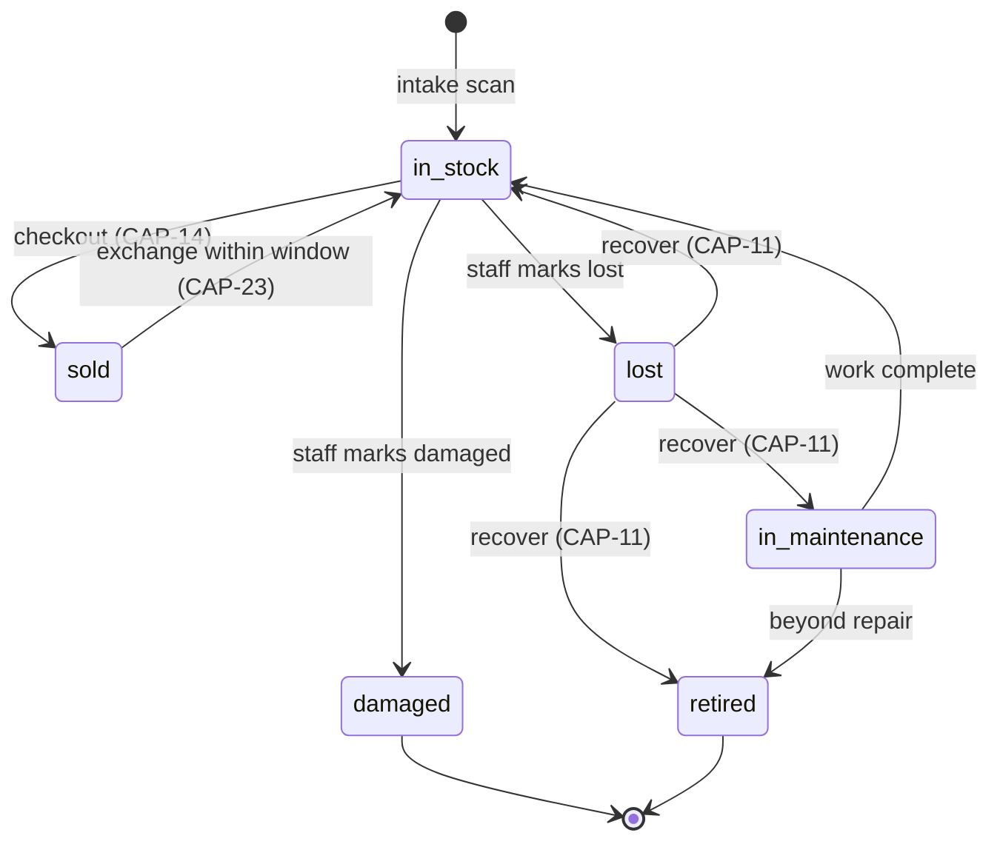
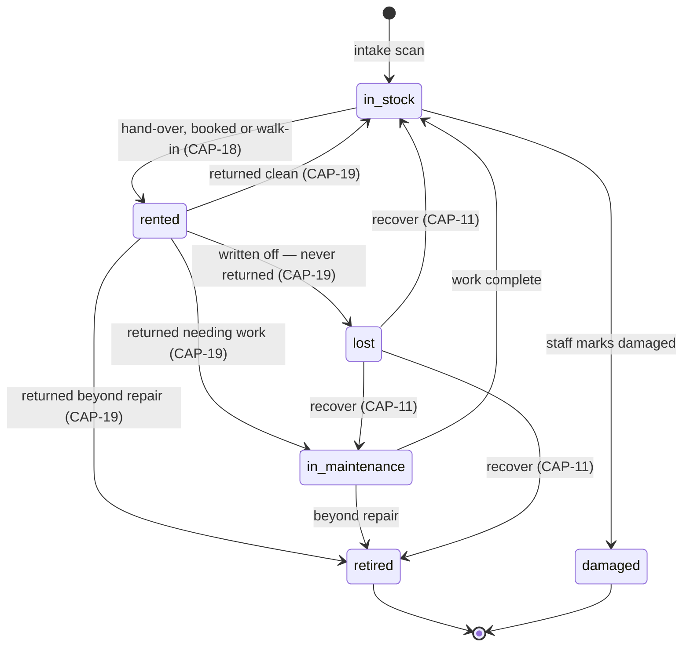

# Unit state machine

The unit's `status` is the spine of the system. Which transitions are legal depends on the unit's `channel`, which lives on the unit itself (defaulted from its lot). CAP-10 requires the server — not the UI — to reject any transition not listed here, naming the current status in the error.

**`in_cart` is not a status.** A cart holds references to units; the unit's status is unchanged while it sits in a cart. Two staff may scan the same barcode into two carts, and exactly one checkout wins — decided by the status change itself, a conditional update that only succeeds while the unit is still `in_stock`, not by a status flag and not by a unique constraint on `unit_id` in sale lines. There is no such constraint: an exchange sells the same unit again on a new line, and the index would refuse it.

**`reserved` is not a status either.** A future booking does not take a unit out of circulation. Rental availability is a query for overlapping open bookings on a date range, so one saree can hold a booking for the 14th–17th and another for the 5th–7th while sitting `in_stock` between them. A unit leaves `in_stock` only when it physically leaves the shop.

---

## Retail channel

| From | To | Trigger | Guard | Record written |
|---|---|---|---|---|
| — | `in_stock` | Barcode scanned into an open lot | Value not already bound to a unit; lot not over quantity | `Unit` + `UnitStatusEvent` |
| `in_stock` | `sold` | Retail checkout | Still `in_stock` at commit; price ≥ floor price; channel is retail | `SaleLine` |
| `sold` | `in_stock` | Exchange scan | Within the configured exchange window (default 7 days) of a non-reversed sale line | Reversing `Sale` + lines, plus the new sale line for the outgoing unit |
| `in_stock` | `damaged` | Staff action | — | `UnitStatusEvent` |
| `in_stock` | `lost` | Staff action | — | `UnitStatusEvent` |
| `lost` | `in_stock` / `in_maintenance` / `retired` | Staff recovers the piece (CAP-11) | `INVENTORY.RECOVER_LOST` — ADMIN and MANAGER only; a reason is mandatory and never defaulted | `UnitStatusEvent` |
| `in_maintenance` | `in_stock` / `retired` | Reached only through a recovery on this channel | — | `UnitStatusEvent` |

There is no refund transition. `sold → in_stock` happens only as one half of an exchange, and the returning unit keeps its original price snapshots.

`damaged` and `retired` are terminal. **`lost` is not** — one arc leaves it, `recover`, and it is the same arc on both channels. A recovered piece keeps its original barcode and its frozen price snapshots; it is never re-intaken as a new unit. `in_maintenance` and `retired` exist on the retail channel as recovery destinations only — nothing else routes a retail unit into them.

Shrinkage counts the buying price out on a transition into `damaged`, `lost` or `retired`, and counts the same figure back in on a recovery out of `lost`. A `lost → retired` recovery is one event row that does both, so it nets to zero and the piece stays written off — while still showing as a recovery in its own right.

---

## Rental channel

| From | To | Trigger | Guard | Record written |
|---|---|---|---|---|
| — | `in_stock` | Barcode scanned into an open lot | As retail | `Unit` + `UnitStatusEvent` |
| `in_stock` | `rented` | Hand-over against a booking, or a walk-in booking-and-hand-over in one step | No overlapping open booking for the window; rent and deposit collected in full; window within `floor(deposit / overduePerDay)` days | `RentalAgreement` |
| `rented` | `in_stock` | Return scan, grade clean | Settlement computed and recorded | Agreement closed |
| `rented` | `in_maintenance` | Return scan, grade repairable | Settlement computed and recorded | Agreement closed |
| `rented` | `retired` | Return scan, grade beyond repair | Settlement computed and recorded; final ROI displayed | Agreement closed |
| `rented` | `lost` | Staff writes the booking off as never returned (CAP-19) | Manual only — with no scheduler, nothing auto-transitions. The deposit-exhaustion date prompts a person; it triggers nothing | One transaction, all three or none: booking → `written_off`, agreement's `writtenOffAt` stamped, unit → `lost`. **The rent and the whole deposit** are recognised as income on `writtenOffAt`'s day — nothing goes back to the customer, and no separate overdue charge is raised on top |
| `lost` | `in_stock` / `in_maintenance` / `retired` | Staff recovers the piece (CAP-11) | `INVENTORY.RECOVER_LOST` — ADMIN and MANAGER only; a reason is mandatory and never defaulted | `UnitStatusEvent`. **Stock value only.** The booking stays `written_off`, the agreement keeps its `writtenOffAt`, and the recognised rent and forfeited deposit stand exactly as recognised — no money row is reversed. A unit recovered to `in_stock` is bookable again with no residue |
| `in_maintenance` | `in_stock` | Work complete | — | `UnitStatusEvent` |
| `in_maintenance` | `retired` | Beyond repair | — | `UnitStatusEvent` |
| `in_stock` | `damaged` | Staff marks damaged off the floor | — | `UnitStatusEvent` |

`retired` and `damaged` are terminal. **`lost` is not** — the `recover` arc leaves it, and it is the same arc as on the retail channel.

> Getting a recovery backwards is catastrophic and plausible. A recovery **adds stock value back** and **leaves income alone**. The mirror image — reversing the income and leaving the stock written off — wipes out money the shop genuinely earned and keeps a piece that is physically on the floor invisible in stock. Both halves are wrong in the same build.

---

## Booking, distinct from status

A `RentalBooking` is a date-range hold that has already been paid for. It moves through its own lifecycle without moving the unit's status:

| Booking state | Meaning | Unit status while in it |
|---|---|---|
| `open` | Booked and paid, not yet collected | `in_stock` — and still bookable for non-overlapping windows |
| `handed_over` | The piece has left the shop | `rented` |
| `settled` | Returned and settled | `in_stock`, `in_maintenance`, or `retired` |
| `cancelled` | Cancelled before hand-over | `in_stock`; the rent is forfeited and becomes income on the cancellation's own day; the deposit is returned in full and is never income |
| `written_off` | The piece never came back | `lost` — until a recovery moves it. The rent **and the whole deposit** become income on `writtenOffAt`'s day; nothing is returned. The booking releases its dates, so the unit's window is free again |

Settling a rental records the agreement's return and moves the booking `handed_over` → `settled` as one indivisible act. A booking left at `handed_over` once the piece is back holds its rent and deposit in the held buckets forever and keeps its dates blocking a floor the shop has available.

The same rule binds the other two exits. A cancellation writes `cancelledAt` and moves the booking to `cancelled`; a write-off writes `writtenOffAt` and moves it to `written_off`, in the same transaction as the unit's move to `lost`. Every exit is one indivisible act, because the state change is what moves the money out of the held buckets and into income — split the two and the figures disagree for the width of a commit.

A unit is unavailable for a requested window if it has an `open` or `handed_over` booking overlapping it. Nothing else blocks a booking — a `settled`, `cancelled` or `written_off` booking releases its dates.

---

## Cross-channel rules

- A unit whose channel is `rental` cannot be added to a retail cart; a unit whose channel is `retail` cannot be booked or rented. Both are refused at scan time, before checkout (CAP-12, CAP-17).
- Only `in_stock` units are sellable. Only `in_stock` units with no overlapping booking are bookable for a given window.
- Overdue is not a status. A `rented` unit past its due date is overdue by derivation at read time; its status stays `rented` until it is returned or written off (CAP-20). The date its deposit runs out — `dueDate + floor(deposit / overduePerDay)` days — is derived on the same read and puts the agreement on a review list. It is a prompt for a person, never a trigger: nothing branches on it beyond whether the row appears in that list.
- Every accepted transition writes a `UnitStatusEvent` carrying actor, timestamp, reason, and the sale line or agreement that caused it. The `status` column is a cached projection of the latest event, not the source of truth for history.
- Channel conversion (retail ↔ rental) is out of scope for this build. The field lives on the unit so it becomes possible without a migration; do not build the conversion flow.
